# Vimeflow

<div align="center">

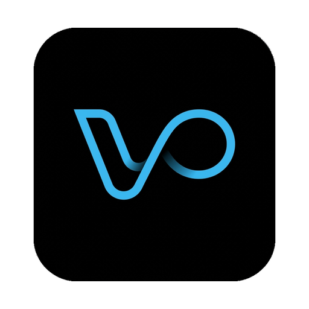

**Why settle for a terminal _or_ a GUI? Have both — boost productivity and stay in your flow.**

Your agent CLIs run in real terminal panes, and the GUI is built around them — not on top of them.

English | [简体中文](./README.zh-CN.md)


</div>

Vimeflow is an Electron desktop app backed by a Rust sidecar (`vimeflow-backend`). A single window gives you agent terminals (native Ghostty panes on macOS), keyboard-driven multi-pane layouts, a file explorer, a vim-mode editor, hunk-level git review, a vim-style command palette, customizable themes, and live observability for Claude Code, Codex CLI, Kimi Code, and OpenCode.

## Contents

- [Native Ghostty terminals on macOS](#native-ghostty-terminals-on-macos)
- [Many agents in one workspace](#many-agents-in-one-workspace)
- [Pick up where you left off](#pick-up-where-you-left-off)
- [Review changes hunk by hunk](#review-changes-hunk-by-hunk)
- [Worktree integration](#worktree-integration)
- [Command palette and settings](#command-palette-and-settings)
- [Themes](#themes)
- [Cursor effects](#cursor-effects)
- [Linux](#linux)
- [Current support](#current-support)
- [Build and run from source](#build-and-run-from-source)
- [Project references](#project-references)

## Native Ghostty Terminals on macOS

Vimeflow doesn't emulate a terminal in the browser. Packaged macOS arm64 builds embed the actual Ghostty engine (`libghostty-spm` with a parented `NSView`), while the Rust sidecar keeps ownership of the PTY. The result is Ghostty's GPU-accelerated rendering inside Electron: output renders as it streams, and panes reflow smoothly during resizes instead of tearing or lagging.

<div align="center">
  
</div>

**Run full-screen TUIs alongside your agents** — `nvim`, `lazygit`, and similar tools work side by side with an agent session and reflow cleanly on resize. Linux and the dev fallback use xterm.js.

<div align="center">
  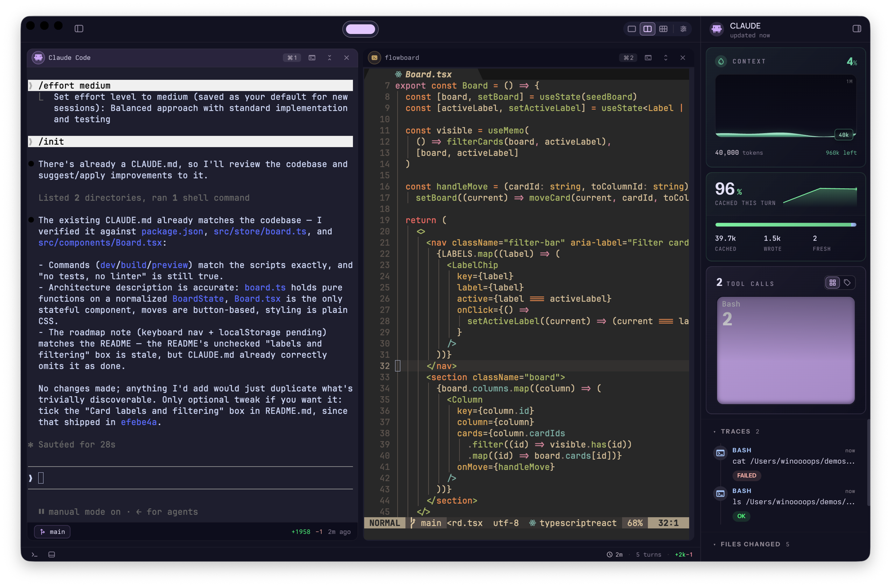
</div>

<sub><i>Try it:<br>1. Launch a packaged macOS build, or `npm run electron:dev:ghostty` from source.<br> 2. Press `⌘;`, run `:layout`, and choose a two-pane layout.<br> 3. Start an agent in one pane and `nvim .` in the other — both are real PTYs.</i></sub>

Terminal working-directory sync relies on OSC 7. `zsh` and `fish` usually emit it automatically; for `bash`, run:

```bash
./scripts/setup-shell-osc7.sh
```

## Many Agents in One Workspace

Most coding-agent CLIs report their state in a single statusline. Vimeflow gives each agent a dedicated panel instead — model, context window, and a live trace feed — detected automatically when you run the CLI, with no wrapper commands required. The trace feed keeps the 50 most recent completed tool calls, organized into per-agent profiles (Claude, Codex, Kimi, and OpenCode each have their own), and any trace that modified the working tree gets a **Show diff** shortcut, so you can jump straight to the change a step made.

<div align="center">
  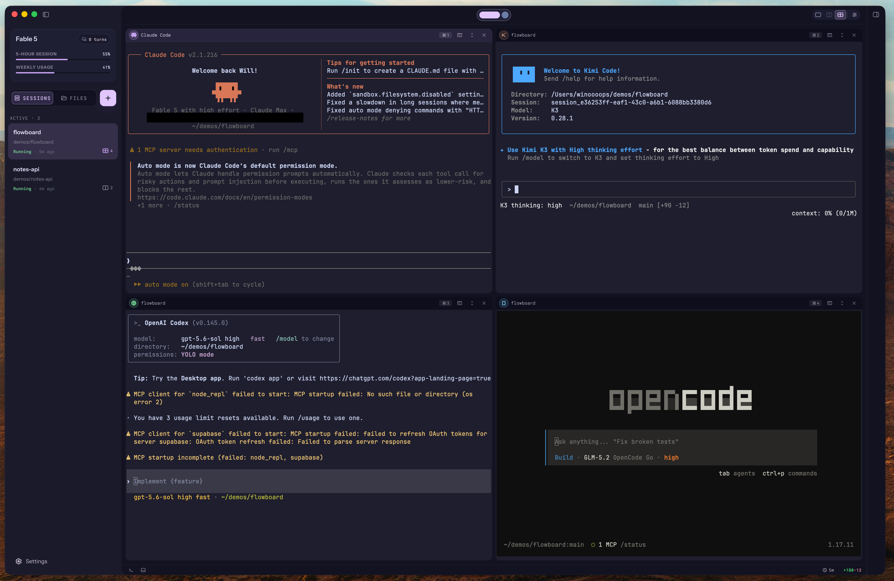
</div>

<sub><i>Try it:<br>1. Click **+** in the sidebar — the New Session dialog takes a session name, a working directory, and optionally the agent command to launch with it.<br> 2. Press `⌘;` and run `:layout` to pick a multi-pane arrangement.<br> 3. Run `claude`, `codex`, `kimi`, or `opencode` in any pane — the status panel picks each one up as it starts.</i></sub>

### Reading the status sidebar

The panel shows a set of live gauges. When you collapse the sidebar, they fold into a compact rail:

<table>
  <tr>
    <td width="28%" valign="top">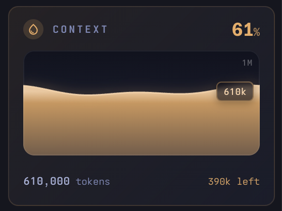</td>
    <td width="28%" valign="top">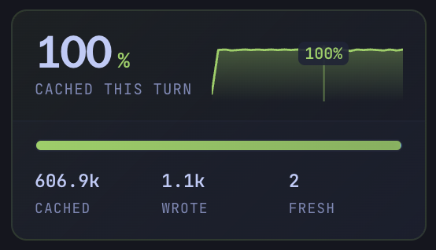</td>
    <td width="28%" valign="top">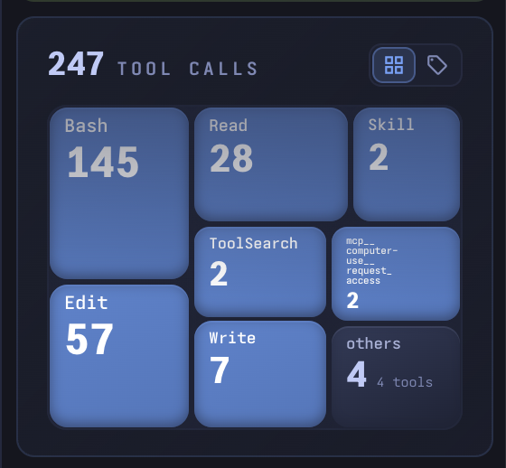</td>
    <td width="16%" valign="top" align="center">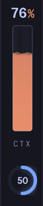</td>
  </tr>
  <tr>
    <td valign="top"><b>Context reservoir</b> — how much of the model's context window remains. The fill changes color as usage grows, so you can see the limit approaching.</td>
    <td valign="top"><b>Cache rate</b> — the share of the current turn served from cache, drawn as a ring. A fuller ring means a cheaper, faster turn.</td>
    <td valign="top"><b>Traces</b> — the 50 most recent completed tool calls: tool, arguments, and result, newest first.</td>
    <td valign="top"><b>Collapsed</b> — the reservoir and ring folded into a single compact rail.</td>
  </tr>
</table>

### Plan usage, where the API allows it

For agents that expose a usage API — currently fully supported for Codex CLI and Claude Code — the panel tracks session and weekly usage next to the model name.

<div align="center">
  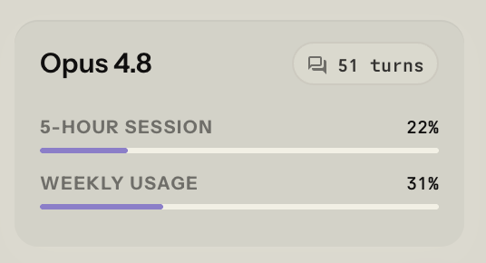
</div>

Kimi Code shows the same bars, with a one-click control to disable tracking entirely:

<div align="center">
  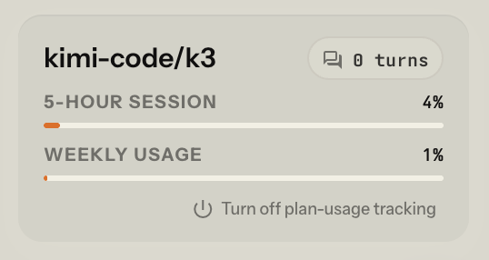
</div>

<sub><i>Kimi Code plan usage is opt-in — fetching it sends your configured Kimi credentials to the Kimi API. Detection, transcript tailing, and activity tracking otherwise stay entirely local (`~/.kimi-code/`).</i></sub>

<sub><i>OpenCode exposes no usage-quota API, so there are no bars to draw — the status card links the upstream request ([sst/opencode#16017](https://github.com/sst/opencode/issues/16017)) instead. It's detected through a small auto-installed bridge plugin that reads model, context window (sized from OpenCode's models.dev cache), and tool activity with zero credential access.</i></sub>

## Pick Up Where You Left Off

Closing Vimeflow doesn't end your agents' day. The workspace remembers every session — its layout, its panes, and the conversation running in each one — and the next launch brings it all back: each agent pane re-issues its own resume command (`claude --resume`, `codex resume`, and friends) against the exact conversation it was in. A workspace full of half-finished tasks reopens as a workspace full of half-finished tasks, not a row of empty prompts.

<div align="center">
  
</div>

<sub><i>Sessions restore together with their layouts. Each detected agent resumes by conversation id; a pane with nothing to resume simply comes back as a fresh shell.</i></sub>

## Review Changes Hunk by Hunk

Vimeflow includes a full inline review surface docked next to your terminals, rather than shelling out to `git diff`. Diffs are rendered by Pierre's engine (`@pierre/diffs`), themed to match your workspace, with the changed-files list one pane over. You can act on hunks in place: stage or unstage a single hunk, or discard a hunk or an entire file.

Review is also interactive. Leave a line-level comment and the agent working in that session replies in the same thread, then fixes the code; the final **Resolve** click stays with you. For a second opinion, **Request review** hands the diff to another reviewer — dispatch it to another agent, or copy the prompt and use it wherever you like. Either way, you can walk through the edits hunk by hunk and catch problems while the code is still being written, without leaving the window.

<div align="center">
  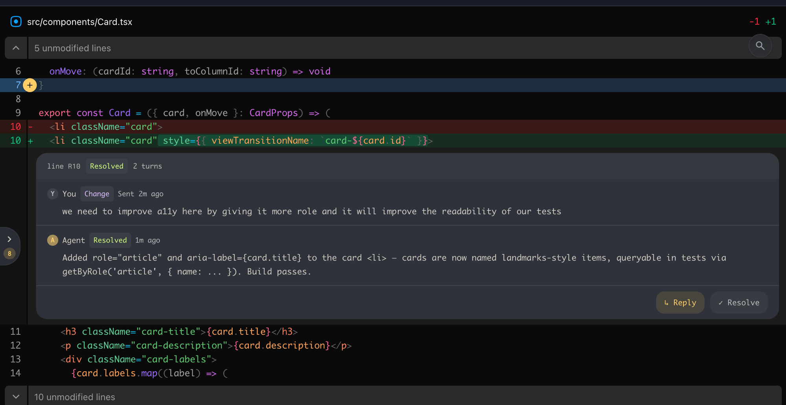
</div>

<sub><i>Try it:<br>1. Open a session in a repository with uncommitted changes.<br> 2. Press `⌘G` (or `⌘;` → `:open-diff`) to open the diff dock next to your panes.<br> 3. Pick a file in the changed-files list and stage, unstage, or discard individual hunks.<br> 4. Tune hunk rendering under **Settings → Version Control → Hunk Appearance**.</i></sub>

## Worktree Integration

Working with several agents usually means several git worktrees, and it's easy to lose track of which one you're looking at. Vimeflow watches each agent's terminal and detects when it enters a worktree — an `Entering worktree(...)` message, a bare `cd`, an `EnterWorktree` skill report, or an OSC 7 hint — then switches the pane to match, with no reload. The git chip in the status bar always shows your current location (`worktree → branch`) and copies the worktree name, its path, or the branch in one click.

<div align="center">
  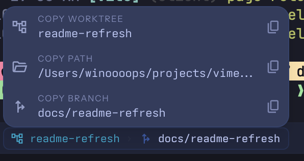
</div>

The worktree an agent lives in also determines what you see: the file explorer follows into that tree, and diff review scopes its changed-files list and hunks to that worktree. You always review the code the agent is actually touching, not a stale checkout.

## Command Palette and Settings

The palette combines command-line speed, Neovim-style aliases, and Zed-style fuzzy matching. `⌘;` opens it: `:new` for a new session, `:layout` for panes, plus `:open-diff`, `:open-editor`, `:theme`, `:settings`, `:goto`, and more — with fuzzy matching and per-command shortcuts. Select the Vim keymap preset if you want Vim-flavored aliases like `:tabnew`, `:vsplit`, `:split`, and `:only`. The settings dialog covers the rest: appearance, keymap, coding agents, editor, terminal, version control, and more.

<div align="center">
  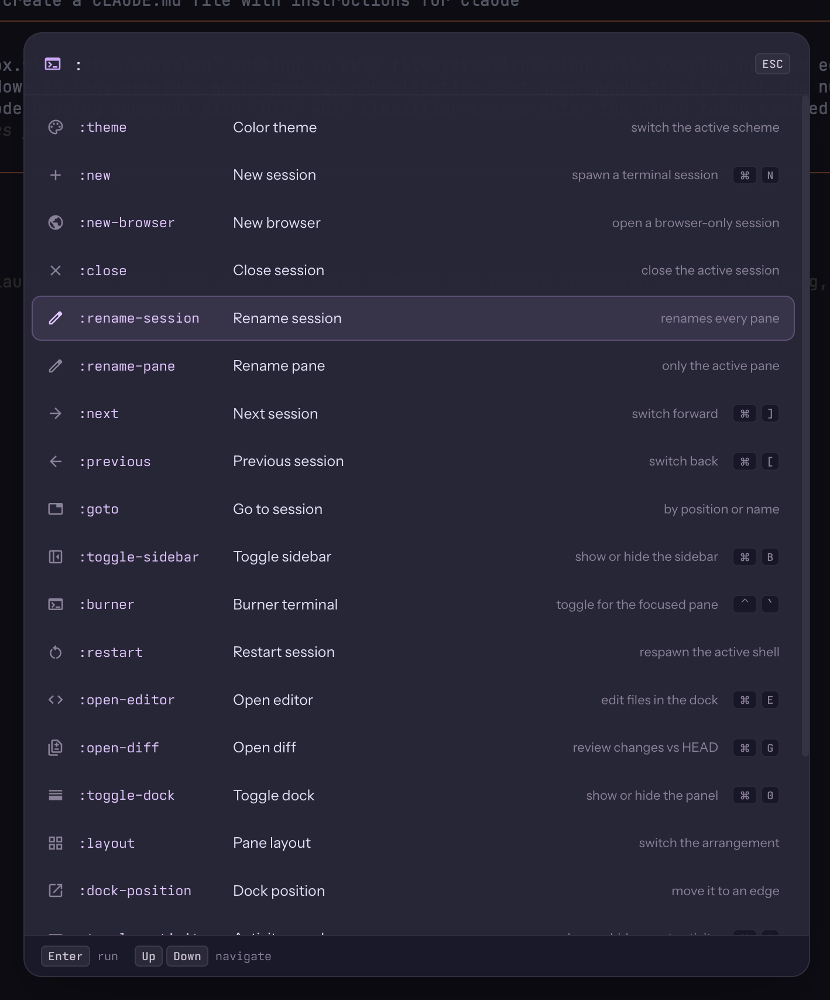
</div>

<sub><i>Try it:<br>1. Press `⌘;` and type a few letters — commands fuzzy-match as you type.<br> 2. Run `:new` to spin up a session, `:goto` to jump between sessions.<br> 3. Open **Settings** (bottom of the sidebar) to remap keys under **Keymap** or configure agent launchers under **Coding Agents**.</i></sub>

## Themes

The Lens theme system ships several built-in themes — **Catppuccin** (dark default), **Flexoki** (light), **Gruvbox** (dark and light), **Tokyo Night**, **Dracula**, and more. Every color in the app is a semantic token, so the whole workspace, terminals included, recolors instantly, with a live preview before you apply. You can also import and export themes as JSON to build your own.

<div align="center">
  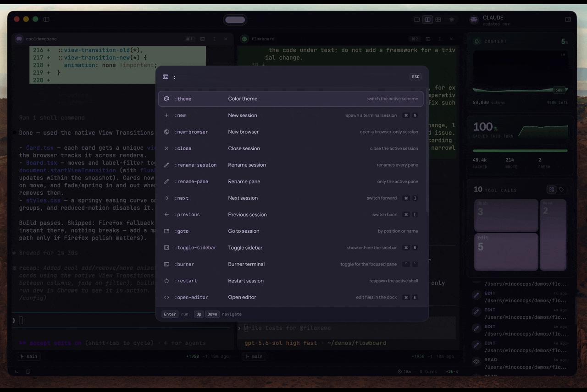
</div>

<sub><i>Try it:<br>1. Press `⌘;` and run `:theme`.<br> 2. Move through the list — the workspace previews each theme live.<br> 3. Press `Enter` to apply, or `Esc` to discard the preview.</i></sub>

## Cursor Effects

Five animated cursor trails, off by default. On macOS they run as real GLSL shaders inside the Ghostty engine; on Linux an xterm.js addon draws the equivalent. Each effect keys off cursor movement, so the difference between them shows up in how they respond to a jump versus a continuous run.

<table>
  <tr>
    <td width="50%" valign="top"><div><sub><b>Warp</b> — stretches between positions on a jump</sub></div>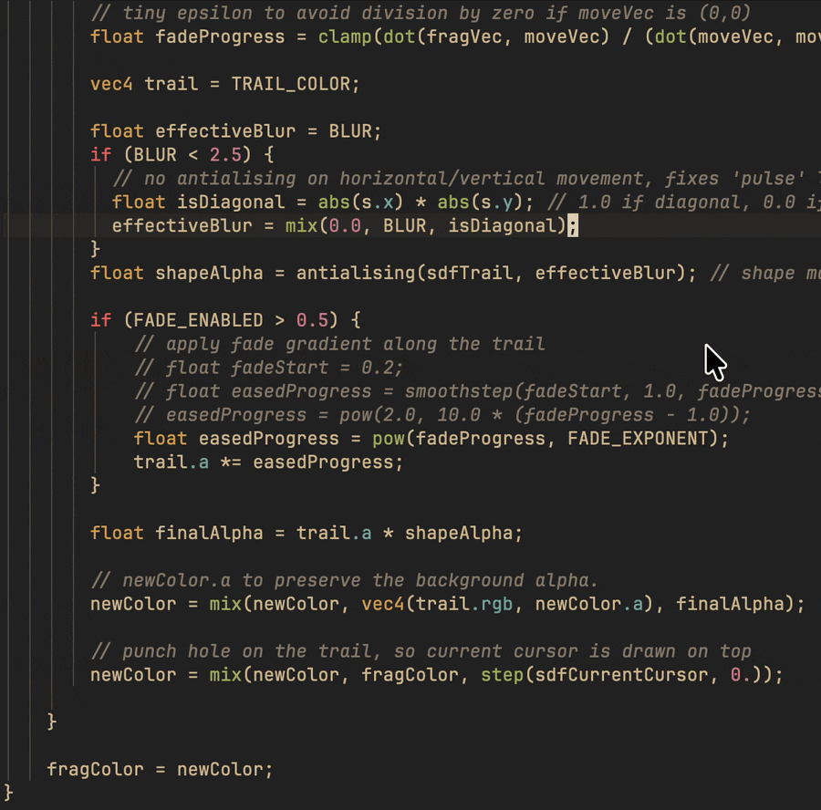</td>
    <td width="50%" valign="top"><div><sub><b>Sweep</b> — a band sweeps along the travelled path</sub></div>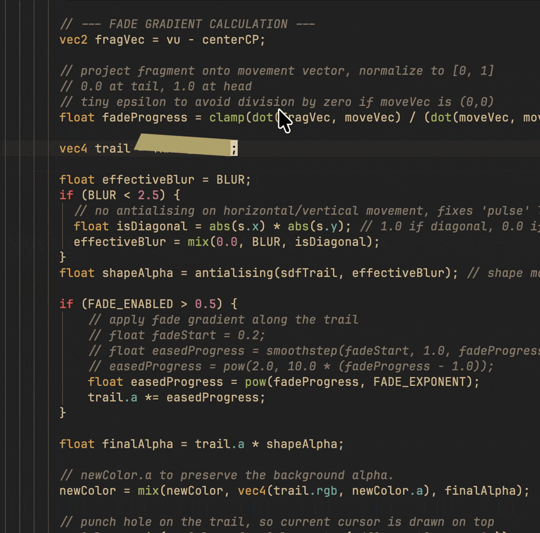</td>
  </tr>
  <tr>
    <td width="50%" valign="top"><div><sub><b>Tail</b> — a fading streak follows the cursor</sub></div>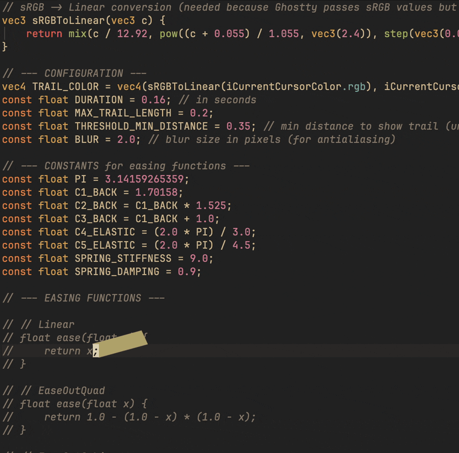</td>
    <td width="50%" valign="top"><div><sub><b>Ripple</b> — a ring expands from each landing point</sub></div>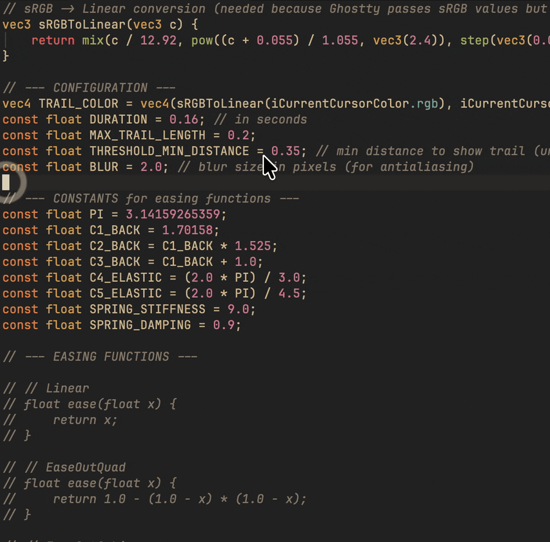</td>
  </tr>
  <tr>
    <td width="50%" valign="top"><div><sub><b>Sonic Boom</b> — a shockwave on fast, long jumps</sub></div>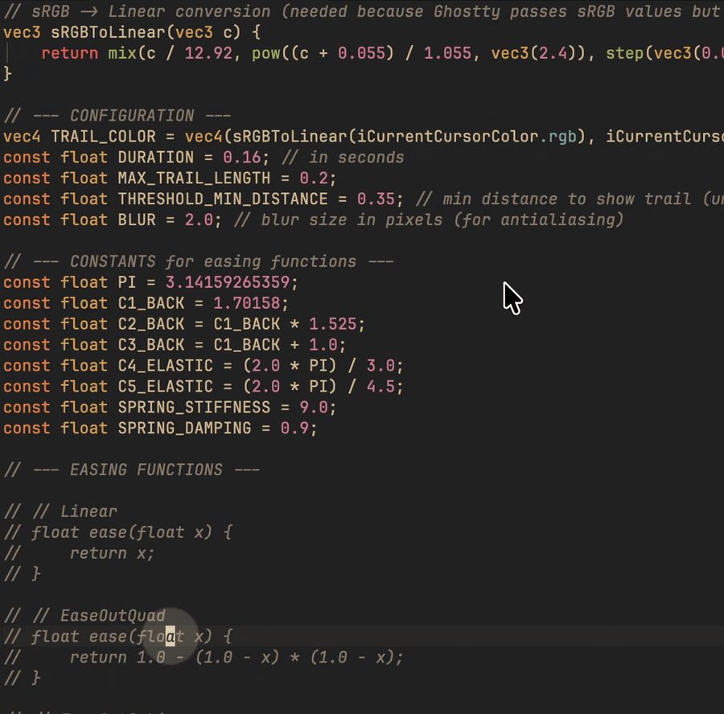</td>
    <td width="50%" valign="top"></td>
  </tr>
</table>

<sub><i>Try it:<br>1. Open **Settings** → **Terminal**.<br> 2. Set **Cursor Effect** to any of Warp, Sweep, Tail, Ripple, or Sonic Boom — it applies live, no restart.<br> 3. Set it back to **Off** to disable.</i></sub>

<sub><i>On macOS these need a `libghostty` with the shader compiler kept in, which [upstream](https://github.com/Lakr233/libghostty-spm) trims out — packaged builds link an [alternate version](https://github.com/winoooops/libghostty-spm-shaders) that keeps it. Linux needs no fork. Shaders are MIT by Sahaj Bhatt ([`sahaj-b/ghostty-cursor-shaders`](https://github.com/sahaj-b/ghostty-cursor-shaders)).</i></sub>

## Linux

Everything above works on Linux as well, with one difference: terminals use xterm.js rather than libghostty (Linux builds do not support the libghostty rendering engine yet). Package it as an AppImage, `chmod +x`, and run it.

<div align="center">
  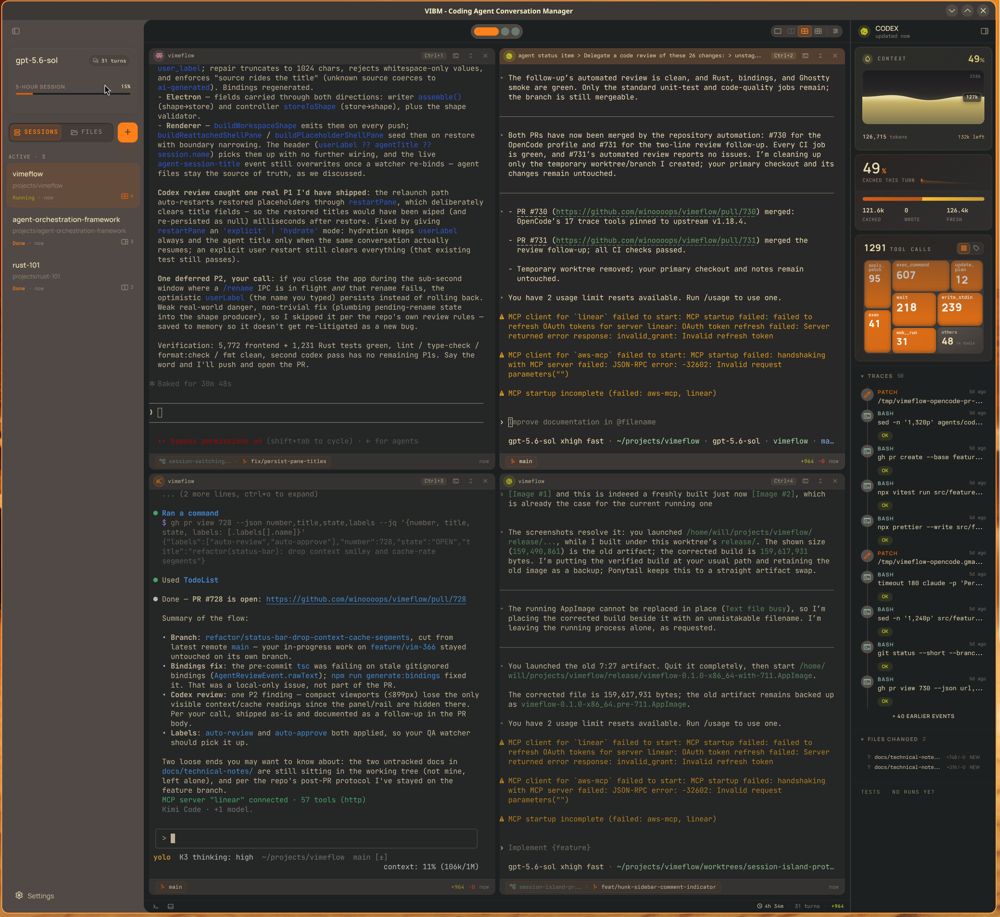
</div>

## Current Support

Vimeflow supports **version 0.1.0 from source**. The nightly workflow is
configured to build unsigned installers from the latest successful
default-branch commit.

- Supported release line: `0.1.0`
- Supported packaged targets: Linux x64 AppImage and macOS arm64 DMG, built locally or by nightly CI
- Desktop runtime: Electron 42 + Rust sidecar over LSP-framed JSON IPC
- Terminal runtime: built-in native Ghostty via `libghostty-spm` for packaged macOS arm64, with xterm.js kept as the Linux/dev fallback
- Agent observability: Claude Code, Codex CLI, Kimi Code, and OpenCode
- Nightly release target: one rolling [`nightly` prerelease](https://github.com/winoooops/vimeflow/releases/tag/nightly), published only when both platforms and the release checks pass
- Not yet supported: stable binary releases, Windows packaging, production signing/notarization, or auto-update

Packaging is host-specific: build the Linux x64 AppImage on Linux x64, and build the macOS arm64 DMG on an Apple Silicon Mac.

## Install a Nightly Build

Download your platform's installer and `SHA256SUMS` from the rolling
[`nightly` release](https://github.com/winoooops/vimeflow/releases/tag/nightly).
Nightlies are experimental snapshots: they are not signed or notarized, do not
auto-update, and are replaced after the next successful nightly run. The
release notes identify the exact source commit and workflow run.

Verify the downloaded file before opening it. SHA-256 detects a damaged or
changed download; the GitHub attestation also verifies that the file came from
this repository's nightly workflow:

```bash
# macOS (run in the download directory)
grep '\.dmg$' SHA256SUMS | shasum -a 256 -c -
gh attestation verify ./vimeflow-*.dmg \
  -R winoooops/vimeflow \
  --signer-workflow winoooops/vimeflow/.github/workflows/nightly-release.yml \
  --source-ref refs/heads/main

# Linux (run in the download directory)
grep '\.AppImage$' SHA256SUMS | sha256sum -c -
gh attestation verify ./vimeflow-*.AppImage \
  -R winoooops/vimeflow \
  --signer-workflow winoooops/vimeflow/.github/workflows/nightly-release.yml \
  --source-ref refs/heads/main
```

Attestation verification requires the
[GitHub CLI](https://cli.github.com/). Do not run an installer if either check
fails.

### Install on macOS

Open the DMG and drag Vimeflow to **Applications**. Because the app has not yet
been signed or notarized with Apple, first launch it by Control-clicking
**Vimeflow** in Applications, choosing **Open**, then confirming **Open**. If
Gatekeeper still blocks that verified copy, remove quarantine from that app
only and open it again:

```bash
xattr -dr com.apple.quarantine /Applications/Vimeflow.app
```

### Install on Linux

Make the AppImage executable and run it:

```bash
chmod +x ./vimeflow-*.AppImage
./vimeflow-*.AppImage
```

If `libfuse2` is unavailable, use `--appimage-extract-and-run`. Use
`--no-sandbox` only if Chromium reports that the host sandbox cannot start;
that fallback disables Chromium's process sandbox.

## Build and Run from Source

Prerequisites:

- Node.js >= 22; Node 24 from `.nvmrc` is preferred for CI parity
- `nvm` is optional but recommended for using `.nvmrc`; skip `nvm use` if Node 24 is already active through another manager
- Rust stable toolchain
- Git
- Linux x64 or Apple Silicon macOS for supported package builds

```bash
git clone https://github.com/winoooops/vimeflow.git
cd vimeflow
nvm use # Optional: switches to Node 24 from .nvmrc
npm ci
```

To keep a dev run fully isolated from an installed Vimeflow (separate sessions, settings, and agent state), point any of the commands below at a throwaway data directory:

```bash
VIMEFLOW_USER_DATA_DIR=/tmp/vimeflow-demo npm run electron:dev
```

### macOS

Run with the **native Ghostty runtime** — the same terminal backbone the packaged build ships:

```bash
npm run electron:dev:ghostty
```

Or run on the **xterm.js** path — same app, no native Ghostty:

```bash
npm run electron:dev
```

Build the arm64 DMG:

```bash
npm run electron:build            # or: npm run electron:build:mac:arm64
```

The DMG lands at `release/vimeflow-*-arm64.dmg`. It bundles the native Ghostty parent runtime and is not signed or notarized.

### Linux

Run from source — terminals are **xterm.js** on Linux (native Ghostty is macOS-only for now):

```bash
npm run electron:dev
```

On hosts without a working Chromium sandbox:

```bash
VIMEFLOW_NO_SANDBOX=1 npm run electron:dev
```

Build the x64 AppImage:

```bash
npm run electron:build            # or: npm run electron:build:linux:x64
```

Then run it:

```bash
chmod +x release/vimeflow-*.AppImage
./release/vimeflow-*.AppImage
```

If the host does not provide `libfuse2`, use AppImage's extract-and-run fallback:

```bash
./release/vimeflow-*.AppImage --appimage-extract-and-run
```

Add `--no-sandbox` only if Chromium reports that the host sandbox cannot
start.

## Use Vimeflow

1. Start Vimeflow with `npm run electron:dev` or a locally built package.
2. Click **+** to create a session in your project, optionally launching `claude`, `codex`, `kimi`, or `opencode` with it.
3. Split panes, browse files, edit code, and review git changes hunk by hunk — see the feature tour above.
4. The agent status panel appears whenever a supported agent is detected.

## Lifeline and Harness Engineering

This repository is also a practical harness-engineering project. Vimeflow's development workflow uses the [Lifeline Claude Code extension](https://github.com/winoooops/lifeline) for planning, autonomous implementation loops, reviews, PR requests, upstream review handling, and PR approval.

Project-local setup notes live in [CLAUDE.md](./CLAUDE.md#lifeline-plugin-setup).

## Verify a Checkout

```bash
npm run lint
npm run format:check
npm run type-check
npm test
cargo test --manifest-path crates/backend/Cargo.toml
```

Regenerate TypeScript bindings after Rust type changes:

```bash
npm run generate:bindings
```

## Project References

- Setup details: [SETUP.md](./SETUP.md)
- Development commands and style: [DEVELOPMENT.md](./DEVELOPMENT.md)
- Architecture and Electron sidecar IPC: [ARCHITECT.md](./ARCHITECT.md)
- Design system: [DESIGN.md](./DESIGN.md) and [docs/design/UNIFIED.md](./docs/design/UNIFIED.md)
- Current roadmap status: [docs/roadmap/progress.yaml](./docs/roadmap/progress.yaml)
- Changelog: [CHANGELOG.md](./CHANGELOG.md) / [CHANGELOG.zh-CN.md](./CHANGELOG.zh-CN.md)
- Backend crate notes: [crates/backend/README.md](./crates/backend/README.md)

## License

MIT
