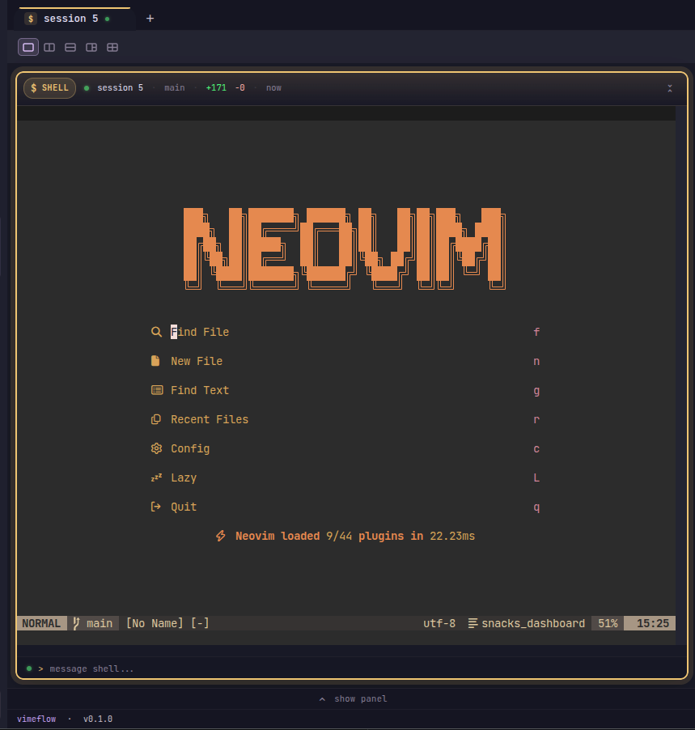

# Vimeflow

<div align="center">

**面向 AI 编码代理的终端优先工作空间**

[English](./README.md) | 简体中文


</div>

Vimeflow 是一个 Electron 桌面应用，使用 Rust `vimeflow-backend` 旁路进程。它把终端会话、多 pane 布局、文件浏览、代码编辑、Git Diff 审查、命令面板，以及 Claude Code / Codex 的实时可观测性集中在一个工作空间中。

## 当前支持范围

Vimeflow 目前**仅支持从源码构建和使用 0.1.0 版本**。

- 支持的版本线：`0.1.0`
- 支持的打包目标：在本地从源码构建 Linux AppImage
- 桌面运行时：Electron 42 + Rust 旁路，通过 LSP 帧 JSON IPC 通信
- 代理可观测性：Claude Code 和 Codex
- 暂不支持：托管二进制发布、macOS / Windows 打包、签名、自动更新

非 Linux 系统上的开发流程可能可用，但当前受支持的构建路径是源码检出加 Linux AppImage 目标。

## 从源码构建和运行

前置条件：

- Node.js >= 22；推荐使用 `.nvmrc` 中的 Node 24 以对齐 CI
- `nvm` 是可选但推荐的 `.nvmrc` 读取工具；如果已通过其他工具启用 Node 24，可跳过 `nvm use`
- Rust stable 工具链
- Git
- Linux（用于当前受支持的 AppImage 打包路径）

```bash
git clone https://github.com/winoooops/vimeflow.git
cd vimeflow
nvm use # 可选：切换到 .nvmrc 中的 Node 24
npm ci
```

从源码运行桌面应用：

```bash
npm run electron:dev
```

如果 Linux 主机没有可用的 Chromium sandbox：

```bash
VIMEFLOW_NO_SANDBOX=1 npm run electron:dev
```

构建受支持的 `0.1.0` AppImage：

```bash
npm run electron:build
chmod +x release/vimeflow-*.AppImage
./release/vimeflow-*.AppImage --no-sandbox
```

如果主机缺少 `libfuse2`，使用 AppImage 回退方式：

```bash
./release/vimeflow-*.AppImage --appimage-extract-and-run --no-sandbox
```

## 使用 Vimeflow

1. 使用 `npm run electron:dev` 或本地构建的 AppImage 启动 Vimeflow。
2. 打开终端 pane，并运行 `claude` 或 `codex`。
3. 在工作空间中拆分 pane、浏览文件、编辑代码并审查 Git Diff。
4. 检测到受支持代理后，代理状态面板会自动显示。

**在同一个 pane 中运行你心爱的 TUI** —— `nvim`、`htop`、`less` 等全屏工具可以和代理会话并排运行。应用内终端是真正的 PTY，本机终端能跑的程序在这里同样能跑。

<div align="center">
  
</div>

终端工作目录同步依赖 OSC 7。`zsh` 和 `fish` 通常会自动发送；`bash` 可运行：

```bash
./scripts/setup-shell-osc7.sh
```

## Lifeline 与 Harness Engineering

这个仓库也是一个实践型 harness engineering 项目。Vimeflow 的开发流程使用 [Lifeline Claude Code 扩展](https://github.com/winoooops/lifeline) 来做规划、自主实现循环、代码审查、PR 请求、上游 review 处理和 PR 批准。

项目本地安装说明见 [CLAUDE.md](./CLAUDE.md#lifeline-plugin-setup)。

## 验证源码检出

```bash
npm run lint
npm run format:check
npm run type-check
npm test
cargo test --manifest-path crates/backend/Cargo.toml
```

Rust 类型变更后重新生成 TypeScript 绑定：

```bash
npm run generate:bindings
```

## 项目参考

- 安装与环境细节：[SETUP.md](./SETUP.md)
- 开发命令与代码风格：[DEVELOPMENT.md](./DEVELOPMENT.md)
- 架构与 Electron 旁路 IPC：[ARCHITECT.md](./ARCHITECT.md)
- 设计系统：[DESIGN.md](./DESIGN.md) 和 [docs/design/UNIFIED.md](./docs/design/UNIFIED.md)
- 当前路线图状态：[docs/roadmap/progress.yaml](./docs/roadmap/progress.yaml)
- 更新日志：[CHANGELOG.zh-CN.md](./CHANGELOG.zh-CN.md) / [CHANGELOG.md](./CHANGELOG.md)
- 后端 crate 说明：[crates/backend/README.md](./crates/backend/README.md)

## 许可证

MIT
