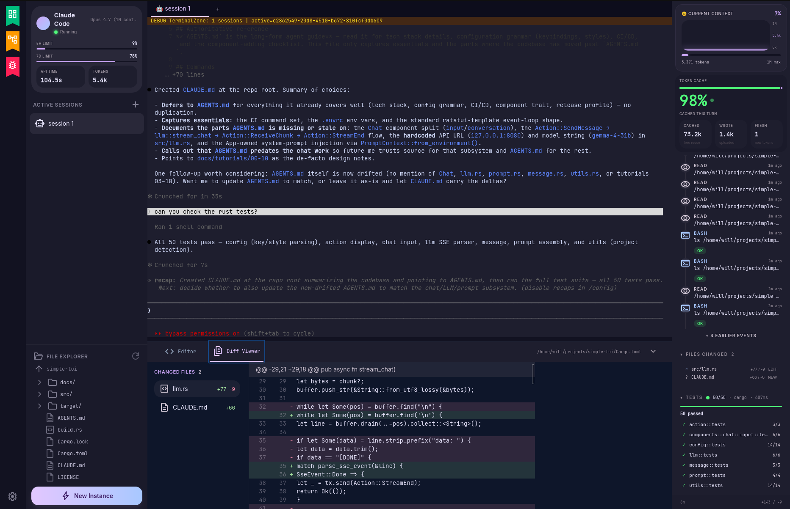
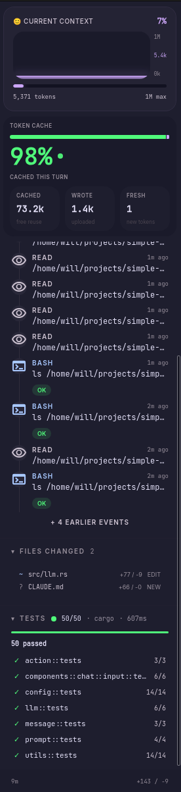
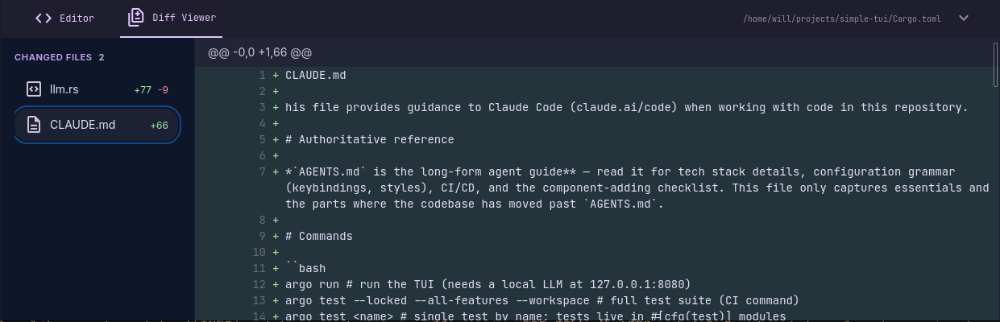

# Vimeflow

<div align="center">

**终端优先时代的 CLI Agent 控制面板**

[English](./README.md) | 简体中文

</div>

<div align="center">


<sub>启动 <code>claude</code>，运行 <code>/init</code>，观察代理面板自动识别并实时显示工具调用。</sub>

</div>

> 一个 Tauri 桌面应用，将终端会话、文件浏览器、代码编辑器和 Git Diff 统一到一个工作空间 — 专为 Claude Code、Codex 等 AI 编码代理打造。

Vimeflow 是一个 **CLI 编码代理控制面板**，基于 Tauri 2（Rust + React/TypeScript）构建。它在一个窗口内管理 AI 代理工作的终端会话、浏览文件、审查 Diff 和编辑代码 — 全部配备 Vim 风格快捷键和暗色氛围 UI。

但产品只是故事的一半。这个仓库也是**工程化 AI 原生开发**的试验场：自主代理循环从规格说明构建功能，由分层规则和专业代理管控。

## 已实现功能



### 终端核心（第 3 阶段）

完整的 xterm.js 终端，集成 Tauri Rust PTY 后端：

- **TauriTerminalService** — xterm.js 与 `portable-pty` 之间的单例 IPC 桥接
- Rust PTY 命令：spawn、write、resize、kill — stdout 通过 Tauri 事件流式传输
- 按标签页缓存会话，支持多标签终端
- ResizeObserver + FitAddon 实现响应式终端尺寸
- WebGL 渲染器 + Catppuccin Mocha 主题

### 工作空间外壳（第 2 阶段 + UI Handoff 第 1-3 步）

借鉴 IDE + 终端复用器模式的终端优先工作空间：

- **图标栏** — 项目头像和导航
- **侧边栏** — 符合 handoff 设计的会话列表，包含状态指示器、副标题、状态胶囊、行数变化
- **会话标签页** — 通过 `useSessionManager` 驱动的浏览器风格标签
- **终端区** — 主工作区域（xterm.js 终端）
- **底部抽屉** — 终端区下方的编辑器和 Diff 面板
- **代理活动面板** — 状态、指标、可折叠区域
- **上下文切换器** — 文件 / 编辑器 / Diff 标签页
- **状态栏** — 紧凑的工作空间状态行

当前 UI handoff 进度见 [`docs/roadmap/progress.yaml`](docs/roadmap/progress.yaml)：第 1-3 步已完成（`#171`、`#173`、`#174`）；下一步是单一 `TerminalPane` handoff。

### 代理状态侧边栏（第 4 阶段）

实时代理可观察性面板，自动检测终端会话中运行的 AI 编码代理。自 [#154](https://github.com/winoooops/vimeflow/pull/154) 起同时支持 **Claude Code** 与 **Codex**，共用一套前端：

- **`AgentAdapter` trait** — `src-tauri/src/agent/adapter/` 定义统一接口（`status_source` / `parse_status` / `validate_transcript` / `tail_transcript`），每种代理各自实现；监听管道、前端事件与面板 UI 与具体代理无关
- **Claude Code 适配器**（`adapter/claude_code/`）— 每会话 shell 脚本把 Claude 的 statusline JSON 写入被监听文件；适配器解析后通过 Tauri 事件发送（`agent-detected`、`agent-status`、`agent-tool-call`、`agent-disconnected`）
- **Codex 适配器**（`adapter/codex/`）— 基于 schema 探测的 SQLite 定位器扫描 `~/.codex/*.sqlite`（logs DB → thread_id，threads DB → rollout JSONL 路径），辅以 Linux `/proc` 快速路径与 FS 扫描回退；将 `event_msg.token_count` 折叠为与 Claude 一致的 `AgentStatusEvent` 形状
- **Rust 后端编排** — `src-tauri/src/agent/` 提供代理检测器（进程树轮询）、`base::start_for` 监听驱动（notify 文件变更 + 轮询回退），以及各适配器的 transcript JSONL tailer（用于工具调用 / 轮次 / 测试运行信号）
- **前端面板** — `src/features/agent-status/` 包含订阅 Tauri 事件总线的 `useAgentStatus` hook，以及组件：StatusCard（身份 + 模型徽章）、BudgetMetrics（自适应 ApiKey / Subscriber / Fallback 布局 — Codex 会话渲染 Subscriber 显示速率限额条；Claude API-key 会话渲染 Cost 单元）、ContextBucket（填充仪表 + 进度条；Codex 由 `last_token_usage` 驱动，Claude 由 `total_input_tokens` 驱动）、ToolCallSummary（聚合芯片）、RecentToolCalls、FilesChanged、TestResults 和 ActivityFooter
- **自动折叠** — 未检测到代理时面板为 0px，检测到时动画展开到 280px，断开后保留最终状态 5 秒
- **ts-rs 类型代码生成** — Rust 类型自动导出到 `src/bindings/`，前端可类型安全消费（`CostMetrics.totalCostUsd: number | null` 用以区分 Codex 不暴露 cost 的语义与 Claude 上报的实际花费）

设计规格：[`2026-04-12-agent-status-sidebar/`](docs/superpowers/specs/2026-04-12-agent-status-sidebar/CLAUDE.md)（面板）· [`2026-05-02-claude-adapter-refactor-design.md`](docs/superpowers/specs/2026-05-02-claude-adapter-refactor-design.md)（trait 抽象，Stage 1）· [`2026-05-03-codex-adapter-stage-2-design.md`](docs/superpowers/specs/2026-05-03-codex-adapter-stage-2-design.md)（Codex 适配器，Stage 2）· [`2026-05-04-codex-adapter-stage-2-scope-expansion.md`](docs/decisions/2026-05-04-codex-adapter-stage-2-scope-expansion.md)（已记录的偏离）

<p align="center">
  
</p>

<p align="center"><sub>右侧面板特写 — 上下文计量器、Token 缓存、活动事件流、变更文件和测试面板。可由 Claude Code 或 Codex 会话经共享 <code>AgentAdapter</code> trait 驱动。</sub></p>

### 功能模块

| 模块                | 描述                                                                                  |
| ------------------- | ------------------------------------------------------------------------------------- |
| **terminal**        | xterm.js + Tauri PTY IPC 桥接，会话管理                                               |
| **editor**          | IDE 风格标签编辑器 — CodeMirror 6、Vim 模式、语言扩展、Vim 状态栏                     |
| **diff**            | Lazygit 风格 Git Diff 查看器（并排 + 统一视图，hunk 导航，暂存/丢弃）                 |
| **files**           | 文件浏览树，面包屑导航，Git 状态徽章（M/A/D/U），拖放支持                             |
| **command-palette** | Vim 风格 `:` 命令面板（全局快捷键、模糊匹配、命名空间下钻）— 内置命令注册表陆续交付中 |
| **agent-status**    | 实时代理可观察性面板 — 通过 `AgentAdapter` trait 同时支持 Claude Code 与 Codex        |
| **workspace**       | 组合以上所有区域的布局外壳                                                            |




### 质量保障

- Vitest + Testing Library 覆盖前端/领域模块，Rust 测试覆盖后端模块
- 无障碍优先的测试查询（`getByRole` 优于 `getByText`）
- Pre-commit 钩子：对暂存文件运行 ESLint + Prettier
- Commit-msg 钩子：commitlint 约定式提交
- Pre-push 钩子：完整 Vitest 运行

## 更新日志

参见 [`CHANGELOG.zh-CN.md`](./CHANGELOG.zh-CN.md)（中文）或 [`CHANGELOG.md`](./CHANGELOG.md)（English）— 记录所有重要变更的线性时间线。每条记录可交叉链接 [`docs/reviews/`](./docs/reviews/CLAUDE.md) 中该变更应用、更新或新增的复盘模式 — CHANGELOG 记录"何时"，`docs/reviews/` 记录"为何"。

## 技术栈

| 层级       | 技术                                                   |
| ---------- | ------------------------------------------------------ |
| **桌面**   | Tauri 2、Rust、portable-pty、tokio                     |
| **前端**   | React 19、TypeScript 5（严格模式）、Vite               |
| **样式**   | Tailwind CSS v4、Catppuccin Mocha 语义化 Token         |
| **终端**   | xterm.js 6、WebGL addon、FitAddon                      |
| **编辑器** | CodeMirror 6、@replit/codemirror-vim（Vim 模式）       |
| **动画**   | Framer Motion 12                                       |
| **测试**   | Vitest 3、Testing Library                              |
| **质量**   | ESLint 9（flat config）、Prettier 3、Husky、commitlint |
| **Git**    | simple-git 3、diff2html 3                              |

## 设计系统："黑曜石之眼"

基于 Catppuccin Mocha 调色板的暗色氛围 UI — 将 UI 视为深邃虚空中的发光半透明层。

- **无可见边框** — 使用色调深度和表面层级（8 级）
- **玻璃态射** 用于浮动元素（60-80% 透明度，12-20px 模糊）
- **字体**：Manrope（标题）、Inter（正文/标签）、JetBrains Mono（代码）
- **语义化 Token**：`bg-surface-container`、`text-on-surface`、`text-primary` 等

完整规格：[`docs/design/DESIGN.md`](docs/design/DESIGN.md)

## 快速开始

```bash
# 前置条件：Node >= 22（推荐通过 .nvmrc 使用 Node 24 以对齐 CI），Rust 工具链
nvm use                          # 使用 .nvmrc

# 仅前端（无 Tauri 后端）
npm install
npm run dev                      # Vite 开发服务器，localhost:5173

# 完整桌面应用（需要 Rust）
npm run tauri:dev                # Tauri + Rust 后端

# 测试
npm test                         # Vitest 测试套件
npx vitest run src/path/file.test.tsx  # 单文件测试

# 质量检查
npm run lint                     # ESLint（类型检查）
npm run format:check             # Prettier 检查
npm run type-check               # tsc -b
```

### Lifeline 插件安装

自主开发工作流现在由抽离后的 [Lifeline Claude Code 插件](https://github.com/winoooops/lifeline)提供，不再由本仓库内置脚本提供。Lifeline 提供 `/lifeline:planner`、`/lifeline:loop`、`/lifeline:review`、`/lifeline:request-pr`、`/lifeline:upsource-review` 和 `/lifeline:approve-pr`。

```bash
# 1. 注册 Lifeline marketplace（一次性）
/plugin marketplace add winoooops/lifeline

# 2. 安装插件
/plugin install lifeline@lifeline

# 3. 重载激活
/reload-plugins
```

安装后，Lifeline 会缓存在 Claude Code 的插件缓存中，并跨会话保留。项目本地说明见 [`docs/lifeline/CLAUDE.md`](docs/lifeline/CLAUDE.md)。

> 由于[已知的 Claude Code 问题](https://github.com/anthropics/claude-code/issues/18949)，插件技能不会出现在 `/` 自动补全中。可选的自动补全变通方法见 [`CLAUDE.md`](CLAUDE.md#lifeline-plugin-setup)。

## 仓库结构

```
CLAUDE.md                   # AI 导航中心（代理从这里开始）
ARCHITECT.md                # 架构决策、Tauri IPC 模式
docs/design/DESIGN.md       # UI 设计系统（唯一真实来源）

src/
├── features/
│   ├── workspace/          # 工作空间外壳、会话标签/侧边栏、底部抽屉
│   ├── terminal/           # xterm.js + TauriTerminalService IPC 桥接
│   ├── editor/             # CodeMirror 标签式代码编辑器
│   ├── diff/               # Lazygit 风格 Diff 查看器
│   ├── files/              # 文件浏览树
│   ├── command-palette/    # Vim 风格命令面板
│   └── agent-status/       # 实时代理可观察性面板
├── components/             # 共享基础组件（Tooltip）
├── hooks/                  # 共享 React hooks
├── agents/                 # Agent 元数据 registry
├── bindings/               # Rust -> TypeScript 生成类型
└── test/                   # Vitest 配置

src-tauri/
├── src/
│   ├── main.rs             # Tauri 入口
│   ├── lib.rs              # 库配置
│   ├── terminal/           # PTY 命令、状态、类型
│   ├── filesystem/         # 列表/读/写命令，含 scope 验证
│   ├── git/                # Git 状态、Diff、暂存/取消暂存
│   └── agent/              # 代理检测器、statusline 监听器、transcript 解析器
├── Cargo.toml              # Rust 依赖
└── tauri.conf.json         # Tauri 配置

agents/                     # 10 个专业 AI 代理定义
rules/                      # 分层开发标准（通用 + TS + Rust）
```

## AI 原生开发流程

传统项目由人类编写代码，AI 辅助。Vimeflow 反转了这一模式：

1. **人类编写规格说明** — 产品需求、设计系统、开发规则
2. **Lifeline 构建功能** — 抽离后的插件将规格分解为功能列表并逐步实现
3. **专业代理审查工作** — 10 个 AI 代理分别负责规划、TDD、代码审查、安全和文档
4. **规则管控一切** — 分层规则系统（通用层 + 语言特定层）确保一致性，无需人工逐次提交干预

旧的仓库内 harness 已抽离到 Lifeline。Vimeflow 本地使用说明见 [`docs/lifeline/CLAUDE.md`](docs/lifeline/CLAUDE.md)，插件运行手册见 <https://github.com/winoooops/lifeline>。

## 路线图

| 阶段       | 状态   | 描述                                                        |
| ---------- | ------ | ----------------------------------------------------------- |
| 第 1 阶段  | 已完成 | Tauri 脚手架、Rust 编译、CI 通过                            |
| 第 2 阶段  | 已完成 | 工作空间布局外壳（4 区网格，所有组件）                      |
| 第 3 阶段  | 已完成 | 终端核心（xterm.js + Tauri PTY IPC）                        |
| 第 4 阶段  | 已完成 | 代理状态侧边栏（检测、statusline 桥接、UI）                 |
| UI Handoff | 进行中 | 第 1-3 步已完成：tokens/registry、应用外壳、侧边栏/会话标签 |
| 第 5 阶段  | 计划中 | 会话管理 + 持久化/状态                                      |
| 第 6+ 阶段 | 计划中 | 剩余 watcher、上下文面板、使用量和桌面打磨                  |

进度跟踪：[`docs/roadmap/progress.yaml`](docs/roadmap/progress.yaml)

## 许可证

MIT
