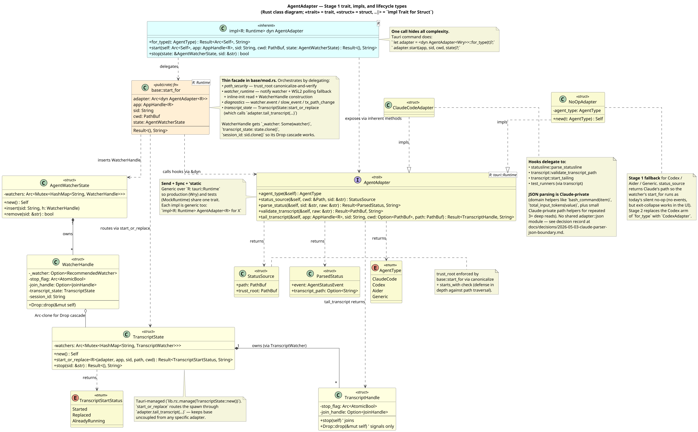

# `agent` — Vimeflow Backend Agent Module

This module owns everything that detects a CLI coding agent inside a PTY session, extracts its status / transcript / tool-call data, and emits Tauri events the frontend agent panel listens for. The design is centred on a single `AgentAdapter<R>` trait that lets each supported agent plug into a shared watcher pipeline.

**Supported today:** Claude Code (Stage 1, [#152](https://github.com/winoooops/vimeflow/pull/152)) and Codex (Stage 2, [#154](https://github.com/winoooops/vimeflow/pull/154)). Aider / etc. are future stages — adding a new adapter is purely additive against the trait.

Stage history:

- Stage 1 — `2026-05-02-claude-adapter-refactor-design.md` introduces the trait and migrates Claude behind it.
- Stage 2 — `2026-05-03-codex-adapter-stage-2-design.md` adds `CodexAdapter` against the trait.
- Stage 2 scope expansion — `docs/decisions/2026-05-04-codex-adapter-stage-2-scope-expansion.md` ratifies three implementation deviations (transcript tailer landed in v1, `/proc` upgraded from verifier to fallback chooser, `BindContext.pid` is the detected agent PID).

This README is the **interface map**. For _why_ the design is shaped the way it is, read the spec; for _how_ to implement the refactor, read the plan; the README is the reference you pull up when you want to know "what does the trait look like, who implements it, and which type goes where."

---

## Class diagram



Source lives in [`architecture.puml`](architecture.puml). To regenerate after editing:

```bash
java -jar /path/to/plantuml.jar -tpng src-tauri/src/agent/architecture.puml
java -jar /path/to/plantuml.jar -tsvg src-tauri/src/agent/architecture.puml
```

Legend:

| Stereotype          | Means                                                                                    |
| ------------------- | ---------------------------------------------------------------------------------------- |
| `<<trait>>`         | Rust trait — the interface contract                                                      |
| `<<struct>>`        | Concrete struct (with fields if any)                                                     |
| `<<enum>>`          | Enum                                                                                     |
| `<<inherent>>`      | Inherent `impl` block on a trait object — methods callable on `Arc<dyn AgentAdapter<R>>` |
| `<<pub(crate) fn>>` | Free function (the orchestrator)                                                         |
| `<<module>>`        | Helper module (free fns)                                                                 |
| `..\|>`             | `impl Trait for Struct` (Rust's "realizes")                                              |
| `*--`               | Composition (owns)                                                                       |
| `o--`               | Aggregation (holds reference / Arc-clone)                                                |
| `..>`               | Dependency (calls / returns)                                                             |

---

## Module tree

```
src-tauri/src/agent/
├── README.md                ← this file
├── architecture.puml        ← class-diagram source
├── architecture.png         ← rendered (committed; regenerated from .puml)
├── architecture.svg         ← rendered (committed; regenerated from .puml)
│
├── mod.rs                   ← module root + re-exports
├── commands.rs              ← Tauri command: detect_agent_in_session
├── detector.rs              ← cmdline-based agent detection (agent-agnostic)
├── types.rs                 ← IPC contract types: AgentType, AgentStatusEvent, AgentToolCallEvent, etc.
│
└── adapter/
    ├── mod.rs               ← trait AgentAdapter<R>, impl<R> dyn AgentAdapter<R>, NoOpAdapter, Tauri commands
    ├── base/
    │   ├── mod.rs           ← thin orchestration facade (start_for<R>, re-exports)
    │   ├── diagnostics.rs   ← watcher.event / slow_event / tx_path_change support types
    │   ├── path_security.rs ← StatusSource trust_root enforcement
    │   ├── transcript_state.rs ← TranscriptState/Handle/StartStatus registry
    │   └── watcher_runtime.rs  ← notify watcher, inline read, polling fallback, WatcherHandle
    ├── types.rs             ← StatusSource, ParsedStatus, ValidateTranscriptError
    ├── claude_code/
    │   ├── mod.rs           ← ClaudeCodeAdapter (impl AgentAdapter<R>)
    │   ├── statusline.rs    ← Claude's status.json parser
    │   ├── transcript.rs    ← Claude's JSONL tail loop + per-line parsing
    │   └── test_runners/    ← vitest / cargo-test parser ecosystem
    └── codex/
        ├── mod.rs           ← CodexAdapter (impl AgentAdapter<R>); per-attach Mutex<Option<PathBuf>> threads the rollout path from status_source to the transcript tailer
        ├── locator.rs       ← CodexSessionLocator: schema-driven SQLite discovery (logs DB → thread_id, threads DB → rollout_path) + Linux /proc fast-paths (resume cmdline, fd cohort, recent state) + FS-scan fallback
        ├── parser.rs        ← Codex rollout JSONL fold: session_meta + turn_context + event_msg.{task_started, task_complete, token_count} → AgentStatusEvent (driven by last_token_usage, not lifetime totals)
        └── transcript.rs    ← Codex rollout JSONL tail loop; reuses claude_code/test_runners/* to emit AgentToolCallEvent / AgentTurnEvent / test-run signals
```

---

## The user-facing surface (production callers)

Everything outside `agent::adapter::*` interacts with the agent module through three calls — that's it.

### `<dyn AgentAdapter<R>>::for_attach`

```rust
pub fn for_attach(
    agent_type: AgentType,
    pid: u32,
    pty_start: SystemTime,
) -> Result<Arc<Self>, String>
```

Constructs the right adapter for a detected agent type. Returns `Arc<dyn AgentAdapter<R>>`:

- `AgentType::ClaudeCode` → `ClaudeCodeAdapter` (`pid`/`pty_start` discarded)
- `AgentType::Codex` → `CodexAdapter::new(pid, pty_start)`
- everything else → `NoOpAdapter::new(t)` (returns errors from `parse_status` / `validate_transcript` / `tail_transcript`; `status_source` returns a `.vimeflow/sessions/{sid}/status.json` placeholder; `pid`/`pty_start` discarded)

> **Resolved 2026-05-05** by [`docs/superpowers/specs/2026-05-05-codex-adapter-trait-simplification-design.md`](../../../docs/superpowers/specs/2026-05-05-codex-adapter-trait-simplification-design.md) (issue [#156](https://github.com/winoooops/vimeflow/issues/156)): `BindContext` is now private to `codex/`, the old bind error type is deleted, the trait method is `status_source(cwd, sid) -> Result<_, String>`, and codex's cold-start retry lives inside `CodexAdapter::status_source` via the `retry_locator` helper.

### `<dyn AgentAdapter<R>>::start`

```rust
pub fn start(
    self: Arc<Self>,
    app: AppHandle<R>,
    session_id: String,
    cwd: PathBuf,
    state: AgentWatcherState,
) -> Result<(), String>
```

Starts the watcher pipeline for a PTY session. **Owns the full lifecycle:** removes any pre-existing handle for `session_id`, logs the active-watcher count, builds the new pipeline, inserts the resulting `WatcherHandle` into `state`. The Tauri command never touches `state` directly — that's the deep-module property.

`pid` is the detected agent PID (returned by `detector::detect_agent`), not the shell PID at the PTY root — Codex's `logs.process_uuid` indexes by the codex child PID. `pty_start` is captured at PTY spawn (`ManagedSession.started_at`) so the logs query can filter out PID-reuse and stale-loaded-thread matches. Both arguments are stored on `CodexAdapter` at construction (`CodexAdapter::new(pid, pty_start)` via the `for_attach(agent_type, pid, pty_start)` factory). The codex adapter wraps them in a private `BindContext` for its locator on each `status_source` call. `base::start_for` invokes `adapter.status_source(cwd, session_id)` once and codex's internal retry lives in `retry_locator` (5 attempts, 4 × 100ms inter-attempt sleeps, 400ms sleep budget on full exhaustion). Claude's impl ignores these fields — Claude's `status_source(cwd, sid)` is infallible.

### `<dyn AgentAdapter<R>>::stop`

```rust
pub fn stop(state: &AgentWatcherState, session_id: &str) -> bool
```

Stops the pipeline by dropping the `WatcherHandle` for `session_id`. Returns `true` if a handle was removed. The handle's `Drop` cascades — see [Lifecycle section](#lifecycle-watcherhandle-drop-cascade) below.

### Tauri command (production entry point)

```rust
#[tauri::command]
pub async fn start_agent_watcher(
    app_handle: tauri::AppHandle,                       // ≡ AppHandle<Wry>
    state: tauri::State<'_, AgentWatcherState>,
    pty_state: tauri::State<'_, crate::terminal::PtyState>,
    session_id: String,
) -> Result<(), String>
```

Backend re-runs detection (`pty_state.get_pid` + `detector::detect_agent`) so the agent-type input is never frontend-supplied. Avoids TOCTOU between frontend detection and watcher start, and matches the project's "validate inputs server-side" pattern.

---

## The trait (provider hooks)

```rust
pub trait AgentAdapter<R: tauri::Runtime>: Send + Sync + 'static {
    fn agent_type(&self) -> AgentType;
    fn status_source(&self, cwd: &Path, session_id: &str) -> Result<StatusSource, String>;
    fn parse_status(&self, session_id: &str, raw: &str) -> Result<ParsedStatus, String>;
    fn validate_transcript(&self, raw: &str) -> Result<PathBuf, String>;
    fn tail_transcript(
        &self,
        app: AppHandle<R>,
        session_id: String,
        cwd: Option<PathBuf>,
        transcript_path: PathBuf,
    ) -> Result<TranscriptHandle, String>;
}
```

Each method is a "provider hook" — every concrete adapter implements all five. The trait is generic over `R: tauri::Runtime` so production (`R = Wry`) and `tauri::test::mock_builder()`-driven integration tests (`R = MockRuntime`) share a single contract.

| Hook                  | Returns                            | Responsibility                                                                                                                       |
| --------------------- | ---------------------------------- | ------------------------------------------------------------------------------------------------------------------------------------ |
| `agent_type`          | `AgentType`                        | Self-identification — used in logs and event payloads.                                                                               |
| `status_source`       | `Result<StatusSource, String>`     | Where the agent writes its status snapshot, plus the trust root the path must canonicalize under. Failures surface as `Err(String)`. |
| `parse_status`        | `Result<ParsedStatus, String>`     | Parse one status snapshot into the typed `AgentStatusEvent` IPC payload. Optional transcript path.                                   |
| `validate_transcript` | `Result<PathBuf, String>`          | Canonicalize and reject any transcript path outside this provider's trust root.                                                      |
| `tail_transcript`     | `Result<TranscriptHandle, String>` | Spawn the per-line tail loop end-to-end — including in-flight tool-call tracking and `TestRunEmitter`.                               |

`TranscriptHandle::Drop` only signals stop (sets `stop_flag`); explicit `TranscriptHandle::stop(self)` joins. This matches today's `transcript.rs:94-108` behavior — Stage 1 preserves it.

---

## Concrete implementations

### `ClaudeCodeAdapter`

Stateless struct (zero fields). Each hook delegates to a sibling module under `claude_code/`:

```rust
impl<R: tauri::Runtime> AgentAdapter<R> for ClaudeCodeAdapter {
    fn agent_type(&self) -> AgentType { AgentType::ClaudeCode }
    fn status_source(&self, cwd, sid) -> Result<StatusSource, String> {
        Ok(StatusSource {
            path: cwd.join(".vimeflow/sessions").join(sid).join("status.json"),
            trust_root: cwd.to_path_buf(),
        })
    }
    fn parse_status(&self, sid, raw) -> Result<ParsedStatus, String> {
        statusline::parse_statusline(sid, raw)  // shaped to ParsedStatus
    }
    fn validate_transcript(&self, raw) -> Result<PathBuf, String> {
        transcript::validate_transcript_path(raw)  // ~/.claude jail
    }
    fn tail_transcript(&self, app, sid, cwd, path) -> Result<TranscriptHandle, String> {
        transcript::start_tailing(app, sid, path, cwd)
    }
}
```

The Claude-Code-specific submodules under `adapter/claude_code/`:

- **`statusline.rs`** — parses Claude's `status.json` schema (model, context window, cost, rate_limits with Anthropic's `five_hour` / `seven_day` shape). Parser flow uses Claude-domain helpers first; repeated deep reads stay as Claude-private helpers.
- **`transcript.rs`** — JSONL tail loop, per-line parser for Anthropic `tool_use` / `tool_result` blocks, `~/.claude` path validation, in-flight tool-call tracking, replay-aware `TestRunEmitter` lifecycle.
- **`test_runners/`** — vitest / cargo-test command matchers and snapshot builders. Invoked from `transcript.rs`'s `process_assistant_message` when a Bash tool call is detected.

### `NoOpAdapter`

Stage 1 fallback for `AgentType::Codex` / `Aider` / `Generic` until a real adapter ships. One field, one constructor:

```rust
pub(crate) struct NoOpAdapter {
    agent_type: AgentType,
}

impl<R: tauri::Runtime> AgentAdapter<R> for NoOpAdapter {
    fn agent_type(&self) -> AgentType { self.agent_type.clone() }
    fn status_source(&self, cwd, sid) -> Result<StatusSource, String> {
        // Same path Claude uses → watcher's create_dir_all + watch
        // matches today's silent-no-op UX for unsupported agents.
        Ok(StatusSource {
            path: cwd.join(".vimeflow/sessions").join(sid).join("status.json"),
            trust_root: cwd.to_path_buf(),
        })
    }
    fn parse_status(&self, _, _) -> Result<ParsedStatus, String>  { Err("…no status parser".into()) }
    fn validate_transcript(&self, _) -> Result<PathBuf, String>    { Err("…no transcript validator".into()) }
    fn tail_transcript(&self, _, _, _, _) -> Result<TranscriptHandle, String> { Err("…no tailer".into()) }
}
```

**Why this exists:** if `for_attach` returned `Err` for unsupported variants, the frontend's exit-collapse path (`useAgentStatus.ts:139-154`, gated on `watcherStartedRef.current`) would never run after a Codex / Aider session exits — the panel would stay in `isActive: true` indefinitely. `NoOpAdapter` returns Claude's status path so the watcher starts successfully (no events ever fire because nothing writes to that path under non-Claude agents), `watcherStartedRef.current` flips to `true`, and exit-collapse runs naturally. See spec IDEA "NoOpAdapter for non-Claude agents in for_attach" for the full rationale.

---

## Provider-hook types

Defined in `adapter/types.rs`. These are the trait's return types.

```rust
pub struct StatusSource {
    pub path: PathBuf,
    pub trust_root: PathBuf,
}

pub struct ParsedStatus {
    pub event: AgentStatusEvent,             // IPC payload (agent/types.rs)
    pub transcript_path: Option<String>,
}
```

`StatusSource.trust_root` is **enforced** by `base::start_for` — the resolved status path's deepest existing ancestor must canonicalize under `trust_root`, both before `create_dir_all` and after (the post-create check catches symlink races). Defense-in-depth against a malicious or buggy adapter returning a path that traverses out of the workspace.

---

## The orchestrator (`base::start_for`)

```rust
pub(crate) fn start_for<R: tauri::Runtime>(
    adapter: Arc<dyn AgentAdapter<R>>,
    app: AppHandle<R>,
    session_id: String,
    cwd: PathBuf,
    state: AgentWatcherState,
) -> Result<(), String>
```

Lives in `adapter/base/mod.rs`. **Private (`pub(crate)`) — production callers never see it; they go through `<dyn AgentAdapter<R>>::start`, which delegates here.**

`base/mod.rs` stays intentionally small. It resolves the adapter's `StatusSource`, delegates trust-root checks to `base/path_security.rs`, removes any existing watcher for the session, logs the active-watcher count, delegates runtime construction to `base/watcher_runtime.rs`, then inserts the resulting `WatcherHandle` into `AgentWatcherState`.

The runtime details are split by responsibility:

1. `base/path_security.rs` canonicalizes `trust_root`, walks to the deepest existing ancestor of `src.path`, asserts under `trust_root`, creates the parent, then re-canonicalizes and re-asserts.
2. `base/watcher_runtime.rs` builds the `notify` watcher with a 100ms debounce, filters events on the target file, performs the inline-init read, and spawns the 3s polling fallback for WSL2/inotify gaps and atomic-write rename patterns.
3. `base/diagnostics.rs` owns `watcher.event` / `watcher.slow_event` / `watcher.tx_path_change` support types: `EventTiming`, `PathHistory`, and `TxOutcome`.
4. `base/transcript_state.rs` owns the transcript registry. When `parse_status` yields a transcript path, the watcher runtime routes through `TranscriptState::start_or_replace(adapter.clone(), …)`, which owns the `(transcript_path, cwd)` identity check, `Replaced` / `AlreadyRunning` short-circuit, and previous-handle cleanup.
5. `base/watcher_runtime.rs` constructs the `WatcherHandle` with `_watcher: Some(...)`, `transcript_state: state.clone()`, and `session_id: sid.clone()` so its `Drop` can cascade.

---

## Lifecycle: `WatcherHandle::Drop` cascade

```rust
pub struct WatcherHandle {
    _watcher: Option<RecommendedWatcher>,        // notify watcher (Option so Drop can take it)
    stop_flag: Arc<AtomicBool>,
    join_handle: Option<JoinHandle<()>>,         // poll-fallback thread
    transcript_state: TranscriptState,           // Arc-clone of the registry
    session_id: String,
    #[cfg(debug_assertions)]
    session_id_for_log: String,
}

impl Drop for WatcherHandle {
    fn drop(&mut self) {
        // ORDER MATTERS — see Behavioral Invariant #8 in the spec.
        drop(self._watcher.take());                       // 1. notify callbacks cease
        self.stop_flag.store(true, Ordering::Relaxed);    // 2a. signal poll thread
        if let Some(h) = self.join_handle.take() {        // 2b. join poll thread
            let _ = h.join();
        }
        let _ = self.transcript_state.stop(&self.session_id);  // 3. join transcript tail
    }
}
```

The order is load-bearing. Rust drops fields _after_ the explicit `Drop` body, so leaving `_watcher` to implicit cleanup means notify callbacks could keep firing throughout the body — including after `transcript_state.stop` runs. A late callback would call `state.start_or_replace(…)` and restart the very tailer we just stopped. Wrapping `_watcher` in `Option` and explicitly dropping it first kills the notify worker before anything else happens.

This cascade is what makes `stop_transcript_watcher` IPC-removal safe: the frontend used to call it as a courtesy after `stop_agent_watcher` because the watcher's drop didn't cascade. Now it does, and the IPC is gone (deleted in Task 13 of the implementation plan).

### `TranscriptHandle` semantics

```rust
impl TranscriptHandle {
    pub fn stop(mut self) {                    // joins
        self.stop_flag.store(true, Ordering::Relaxed);
        if let Some(handle) = self.join_handle.take() {
            let _ = handle.join();
        }
    }
}

impl Drop for TranscriptHandle {
    fn drop(&mut self) {                        // signal-only
        self.stop_flag.store(true, Ordering::Relaxed);
    }
}
```

`Drop` only flips the flag (the tail thread polls it on its next iteration); explicit `stop(self)` is what blocks until the thread joins. `TranscriptState::stop(sid)` removes the handle from the registry and calls `handle.stop()`, so the cascade does join end-to-end.

---

## `TranscriptState` registry

```rust
pub struct TranscriptState {
    watchers: Arc<Mutex<HashMap<String, TranscriptWatcher>>>,
}

impl TranscriptState {
    pub fn new() -> Self { … }
    pub fn start_or_replace<R: Runtime>(
        &self,
        adapter: Arc<dyn AgentAdapter<R>>,
        app: AppHandle<R>,
        session_id: String,
        transcript_path: PathBuf,
        cwd: Option<PathBuf>,
    ) -> Result<TranscriptStartStatus, String>;
    pub fn stop(&self, session_id: &str) -> Result<(), String>;
    pub fn contains(&self, session_id: &str) -> bool;
}

pub enum TranscriptStartStatus { Started, Replaced, AlreadyRunning }
```

Tauri-managed via `lib.rs`'s `.manage(TranscriptState::new())`. **Visibility:** `pub #[doc(hidden)]` — production code goes through the trait surface (`AgentAdapter::start`), but four `tests/transcript_*.rs` integration tests drive `TranscriptState::start_or_replace` directly to isolate transcript-parsing assertions from watcher-orchestration assertions. `#[doc(hidden)]` keeps it out of generated docs; a doc-comment on each pub item warns "Test-only public surface — production code MUST use AgentAdapter::start instead."

`start_or_replace` takes `Arc<dyn AgentAdapter<R>>` so the registry can route the spawn through `adapter.tail_transcript(…)` without re-coupling `base` to any specific adapter. The replace-vs-keep identity check on `(transcript_path, cwd)` is unchanged — only the spawn site changes.

---

## Claude parser JSON boundary

There is intentionally **no** shared `agent::adapter::json` module. Only Claude uses JSON parser helpers today, so shared adapter-level helpers would be premature until Codex / Aider prove the same abstraction is useful.

Parser flow calls **domain functions** first — the call site reads as Claude concepts, not JSON paths:

```rust
// transcript.rs — extract a Bash tool_use's command field
fn bash_command(item: &Value) -> Option<&str> { … }

let test_match = bash_command(item).and_then(|cmd| match_command(cmd, cwd));

// statusline.rs — domain accessors over the context_window subtree
fn total_input_tokens(value: &Value) -> u64 { … }
fn current_usage(value: &Value) -> Option<CurrentUsage> { … }

let context_window = ContextWindowStatus {
    total_input_tokens: total_input_tokens(value),
    current_usage: current_usage(value),
    // …
};
```

Inside those domain helpers:

- **1-2 level reads** use explicit `.get().and_then(...)` because the JSON shape is right there in the code.
- **3+ deep, repeated** reads use small **Claude-private** path helpers (`f64_at`, `u64_or`, `f64_or` in `claude_code/statusline.rs:368-378`). They're free fns inside `claude_code/statusline.rs` — not exported, not promoted to `adapter::json`, not visible to other adapters.
- Generic `at` / `_or` helpers stay implementation details of the Claude parser. Promote them to `adapter::json` (or whatever) only after Codex's parser actually demonstrates the same shape is useful.

Full rationale and rejected alternatives in [`docs/decisions/2026-05-03-claude-parser-json-boundary.md`](../../../docs/decisions/2026-05-03-claude-parser-json-boundary.md).

---

## Detection (agent-agnostic)

`detector.rs` is shared across every adapter — it inspects the PTY process tree and matches the bare binary name (`claude`, `codex`, `aider`) against `AgentType` variants. No adapter-specific logic; the result feeds `<dyn AgentAdapter<R>>::for_attach`.

`commands.rs::detect_agent_in_session` is the Tauri command the frontend polls every 2s.

---

## See also

- **`docs/superpowers/specs/2026-05-02-claude-adapter-refactor-design.md`** — the design spec (architectural decisions, rationale, IDEA blocks).
- **`docs/superpowers/plans/2026-05-03-claude-adapter-refactor-stage-1.md`** — the implementation plan (14 tasks, 91 bite-sized steps, exact code).
- **`docs/decisions/2026-05-03-claude-parser-json-boundary.md`** — why parser helpers stay Claude-private until a second adapter exists.
- **`rules/common/design-philosophy.md`** — the deep-module / interface-discipline principles this design is grounded in.
- **`rules/rust/patterns.md`** — Tauri command shape, managed state, event system.
