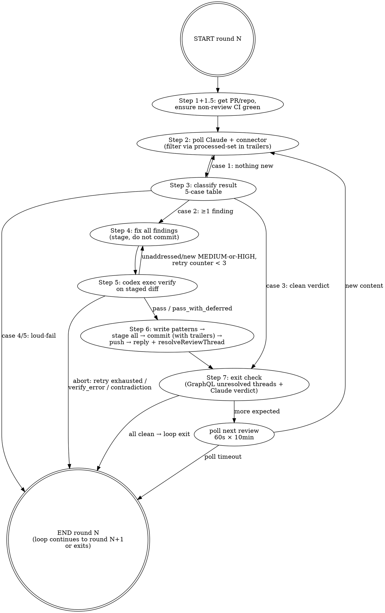

# `/harness-plugin:github-review` — Connector-Aware Review Loop

**Date**: 2026-04-29
**Status**: Design — pending implementation plan
**Tracks**: Issue [#111](https://github.com/winoooops/vimeflow/issues/111)
**Builds on**: [`docs/reviews/CLAUDE.md`](../../reviews/CLAUDE.md), [`2026-04-09-review-knowledge-base-design.md`](./2026-04-09-review-knowledge-base-design.md), [PR #109 retrospective](../../reviews/retrospectives/2026-04-29-tests-panel-bridge-session.md)

## Problem

The current `/harness-plugin:github-review` skill polls the wrong API surface. Step 2 of `plugins/harness/skills/github-review/SKILL.md` filters issue comments for the header `## Codex Code Review`:

```bash
gh api "repos/$REPO/issues/$PR_NUMBER/comments" \
  --jq '[.[] | select(.body | contains("## Codex Code Review"))] | last | {id, body}'
```

This matches the older aggregated `openai/codex-action@v1` workflow (`.github/workflows/codex-review.yml`), which has been hitting `Quota exceeded` on every push for two PRs running. The actionable Codex findings now come from a **separate** `chatgpt-codex-connector[bot]` GitHub App integration, which posts on two surfaces the skill never queries:

1. **PR review summaries** at `/repos/{owner}/{repo}/pulls/{pr}/reviews` — body header `### 💡 Codex Review`
2. **Inline file-level comments** at `/repos/{owner}/{repo}/pulls/{pr}/comments` — body shape `**<sub><sub>![P1 Badge]...</sub></sub>  <Title>**` followed by description, plus top-level `path` / `original_line` fields

On PR #109 the connector posted 5 inline findings (1 P2 + 4 P1) across 4 review rounds before the user noticed. The skill silently returned empty (`last` over an empty `select()` filter), the loop reported "no findings", and the P1s went unprocessed for 4 rounds — including a credential-leak class issue (`Authorization` regex consuming only the first token) that the parallel Claude reviewer also missed in its first pass.

The retrospective at `docs/reviews/retrospectives/2026-04-29-tests-panel-bridge-session.md` captures the full incident.

Secondary problems exposed by the same incident:

- The aggregated `codex-review.yml` workflow burns OpenAI quota on every push but produces nothing actionable — its `Post Review Comment` job is permanently stuck on `ERROR: Quota exceeded`.
- Connector inline comments are review threads (`reviewThread` GraphQL objects). Resolving them requires the GraphQL `resolveReviewThread` mutation; REST has no equivalent.
- The skill has no post-fix verification — fixes can introduce new issues that won't be caught until the next review round (`Authorization` regex fix on PR #109 was nearly shipped with a Bearer-charset gap).
- Pattern-file appends to `docs/reviews/patterns/*.md` have been done by hand at PR completion. The KB drifts when not updated consistently.

## Solution

Rewrite the skill to:

1. **Consume the right surfaces.** Poll Claude (`github-actions[bot]` issue comments with `## Claude Code Review` header — the surviving aggregated reviewer) AND chatgpt-codex-connector (PR reviews + inline comments). Treat connector inline comments as the actionable units; use the connector's summary review only for "is this run clean" verdicts.
2. **Track processed state via commit trailers.** Store sets of processed comment / review / inline IDs as Git commit message trailers on each fix commit. No `.json` state file. Watermarks are derived from `git log --grep "GitHub-Review-Processed-"` on cycle start.
3. **Batch fixes per cycle.** Each cycle = poll both reviewers → aggregate every unprocessed finding → fix all → run **post-fix Codex verify** on the staged diff → single commit (with pattern updates inline) → push → reply + resolve connector threads → poll for next round.
4. **Disable the broken aggregated workflow.** Rename `.github/workflows/codex-review.yml` to `codex-review.yml.disabled`. Single-commit revert if quota is later restored.
5. **Mandate pattern-file appends per fixed finding.** Land them in the same commit as the code fix. Retros remain optional, prompted at loop exit.

The skill now exits **loudly** in any "data not found / data not parseable" case. The original silent-empty failure mode is removed by an explicit case-classification table (Section [Loop flow](#loop-flow)).

## Decisions

| Decision                   | Choice                                                                                       | Rationale                                                                                                                                                                               |
| -------------------------- | -------------------------------------------------------------------------------------------- | --------------------------------------------------------------------------------------------------------------------------------------------------------------------------------------- |
| Disabled workflow          | Rename `codex-review.yml` → `codex-review.yml.disabled`                                      | Reversible single commit. GitHub Actions ignores non-`.yml`/`.yaml` files. Avoids burning OpenAI quota for nothing.                                                                     |
| Reviewer surfaces consumed | Claude (issue comments) + Codex connector (PR reviews + inline comments)                     | Both reviewers' findings reach the loop. Connector inline = actionable; connector summary = verdict signal.                                                                             |
| Cycle granularity          | Per-cycle batch (one commit per round covering all unprocessed findings from both reviewers) | Matches reviewer intent ("review run = N findings as a coherent unit"). One Codex verify pass per cycle, one CI burn per cycle, clean PR history.                                       |
| State persistence          | In-memory finding table (transient), watermarks in commit message trailers                   | Avoids two-source-of-truth sync. Aligns with auto-memory `lazy_reconciliation_over_shutdown_hooks`. Git history doubles as audit log.                                                   |
| Codex verify               | `codex exec --sandbox read-only --output-schema` on staged diff, post-fix, pre-commit        | Gates new-issue introduction. Reuses existing `.github/codex/codex-output-schema.json`. ChatGPT-auth-compatible (no `--model` flag per memory `feedback_codex_model_for_chatgpt_auth`). |
| Verify retry budget        | ≤3 verify attempts per cycle; abort cycle and exit loop if exceeded                          | 3 failed verifies = fix logic broken or reviewers in disagreement. Continuing produces noise. User-led recovery.                                                                        |
| Pattern append discipline  | Mandatory per fixed finding; same commit as the code fix                                     | KB only earns ref-count value if writes are consistent. Atomicity ensures fix and KB entry land together.                                                                               |
| Retro write-up             | Optional, prompted at loop exit; not auto-written by skill                                   | Synthesis needs hindsight. Mandatory low-value retros pollute the directory.                                                                                                            |
| Thread resolution          | GraphQL `resolveReviewThread` mutation, after push                                           | REST has no resolve-thread endpoint. Reply must come after push so the cited commit SHA exists on origin.                                                                               |

## Architecture

### Loop flow



The dashed lines represent flow only — the actual skill prompt is step-numbered prose with bash blocks per step (the existing format).

### File structure

Existing layout is monolithic — one `SKILL.md` per skill in `plugins/harness/skills/<name>/`. We keep the monolithic shape:

```
plugins/harness/
├── .claude-plugin/plugin.json   # unchanged
└── skills/
    ├── github-review/SKILL.md   # FULL REWRITE — Sections below
    ├── loop/SKILL.md            # unchanged
    └── review/SKILL.md          # unchanged
```

Helper-script extraction (e.g. `lib/codex-verify.sh`) is **not** in scope. The skill stays as one file. We can split later if it crosses ~700 lines (currently 150; revised will be ~500–600).

## Components

### 0. Input resolution

The skill supports both current-branch operation and explicit PR targeting. **Explicit PR targeting only changes which PR is _read_ from — write operations (commit, push) still happen on the current `git` checkout.** Step 0 enforces that the current branch matches the PR's head ref so fixes can never accidentally land on the wrong branch.

```bash
# If the user supplied a PR number, use it. Otherwise resolve the current
# branch's PR.
if [ -n "${USER_SUPPLIED_PR_NUMBER:-}" ]; then
  PR_NUMBER="$USER_SUPPLIED_PR_NUMBER"
else
  PR_NUMBER=$(gh pr view --json number --jq .number 2>/dev/null)
fi

if [ -z "${PR_NUMBER:-}" ]; then
  echo "ERROR: No PR found. Either:" >&2
  echo "  1) Run from a branch that has an open PR, or" >&2
  echo "  2) Set USER_SUPPLIED_PR_NUMBER=<number> AND check out the PR's head branch" >&2
  echo "     (or use a worktree on that branch)." >&2
  exit 1
fi

REPO=$(gh repo view --json nameWithOwner --jq .nameWithOwner)
OWNER=${REPO%%/*}
NAME=${REPO#*/}
BASE_REF=$(gh pr view "$PR_NUMBER" --json baseRefName --jq .baseRefName)
HEAD_REF=$(gh pr view "$PR_NUMBER" --json headRefName --jq .headRefName)

# Safety guard — current branch MUST match the PR's head ref. Otherwise commit
# and push would land on the wrong branch.
CURRENT_BRANCH=$(git branch --show-current)
if [ "$CURRENT_BRANCH" != "$HEAD_REF" ]; then
  echo "ERROR: Current branch is '$CURRENT_BRANCH' but PR #$PR_NUMBER head is '$HEAD_REF'." >&2
  echo "Fixes would commit + push to the wrong branch." >&2
  echo "Either:" >&2
  echo "  1) git switch '$HEAD_REF' (if no other in-progress work blocks it), or" >&2
  echo "  2) Create a worktree on the PR branch:" >&2
  echo "       git worktree add .claude/worktrees/$HEAD_REF '$HEAD_REF'" >&2
  echo "       cd .claude/worktrees/$HEAD_REF" >&2
  echo "     and re-run the skill from there." >&2
  exit 1
fi
```

Explicit PR targeting (`USER_SUPPLIED_PR_NUMBER`) is required for the throwaway-PR self-test in the [Acceptance gate](#acceptance-gate-pre-merge); the self-test invokes the skill from a worktree whose branch matches the throwaway PR's head, satisfying the guard.

### 1. State persistence (in-memory + commit trailers)

**Finding table is transient.** It exists only in the agent's reasoning context for the duration of one cycle. After commit, it's discarded. Next cycle re-derives from GitHub state.

**Watermarks live as commit-message trailers** on each fix commit:

```
GitHub-Review-Processed-Claude: 2156804
GitHub-Review-Superseded-Claude: 2156789,2156712
GitHub-Review-Processed-Codex-Reviews: 4193776289,4193823412
GitHub-Review-Processed-Codex-Inline: 3158344534,3158344712,3158450119
Closes-Codex-Threads: PRRT_kwDOL...,PRRT_xyz...
Pattern-Files-Touched: docs/reviews/patterns/async-race-conditions.md, docs/reviews/patterns/filesystem-scope.md, docs/reviews/CLAUDE.md
Pattern-Append-Decisions:
- F1 (alias recursion) → patterns/async-race-conditions.md (existing, theme: bounded recursion)
- F2 (Authorization regex) → patterns/credential-leakage.md (NEW pattern)
Verify-Deferred-LOW: <list of verify-found LOW issues deferred>  # only if any
Verify-Skipped: docs-only  # only if 5F escape triggered
```

Cycle start derives `$PR_BASE` from the PR's actual base branch (NOT a hard-coded `main` — works across base-branch renames and stacked PRs), then walks commits between that base and HEAD to extract the processed set:

```bash
# Resolve the base ref the PR actually targets.
BASE_REF=$(gh pr view "$PR_NUMBER" --json baseRefName --jq .baseRefName)

# Use merge-base so we count only commits unique to this branch — robust against
# upstream advancing while the PR is open. Requires `origin/$BASE_REF` to be
# fetched; the skill runs `git fetch origin "$BASE_REF" --no-tags` first.
git fetch origin "$BASE_REF" --no-tags
PR_BASE=$(git merge-base HEAD "origin/$BASE_REF")

# Now extract trailers from this PR's commit range.
git log "$PR_BASE..HEAD" --pretty=%B \
  | awk '/^GitHub-Review-Processed-Claude:/ {print}'
# … one awk per trailer key, parsed into shell arrays / jq-friendly JSON
```

`Processed-Claude ∪ Superseded-Claude` is the set of "Claude comment IDs we no longer need to process". Any current Claude comment whose ID is not in this union is unprocessed.

For Codex: `Processed-Codex-Reviews` filters which review IDs have been handled; `Processed-Codex-Inline` filters individual comment IDs. Connector emits a fresh review run per push; inline comments tie to a `pull_request_review_id`. We process both sets independently to handle race conditions where inline comments arrive separately from the parent review object.

**Why not a JSON state file?** Per the auto-memory `lazy_reconciliation_over_shutdown_hooks` and `filesystem_cache_for_pty`: live-derivable state should not be persisted. GitHub is the source of truth. A separate file creates sync risk (handle SIGKILL / OOM / crash), and resume-after-crash is a non-goal — a re-poll from GitHub is cheap.

### 2. Reviewer poll & parse

#### 2.1. Claude reviewer

**Poll:**

```bash
gh api "repos/$REPO/issues/$PR_NUMBER/comments" --paginate \
  --jq '[.[] | select(
           .user.login == "github-actions[bot]"
           and (.body | startswith("## Claude Code Review"))
         )]'
```

`startswith` (not `contains`) avoids matching human comments that quote the header.

**Filter:** subtract `Processed-Claude ∪ Superseded-Claude` from the result. Of what remains, **take only the latest by `created_at`** — Claude is aggregated; older unprocessed comments are stale-by-construction.

**Mark superseded:** all older Claude comment IDs (created_at < the chosen comment's created_at) that are not yet in any trailer get added to the next commit's `GitHub-Review-Superseded-Claude:` trailer. This prevents perpetual re-processing.

**Parse format** (verified on PR #109):

```
## Claude Code Review

### 🟠 [HIGH] match_command recurses infinitely on cyclic npm script aliases

📍 `/home/runner/work/vimeflow/vimeflow/src-tauri/src/agent/test_runners/matcher.rs` L103-108
🎯 Confidence: 93%

<finding body, possibly multi-paragraph, may include code blocks>

<details><summary>💡 IDEA</summary>
- **I — Intent:** ...
- **D — Danger:** ...
- **E — Explain:** ...
- **A — Alternatives:** ...
</details>

---
```

Per finding (split on `---`):

- `severity`: regex `### .* \[(\w+)\]` → group 1
- `title`: same line after `]` to end-of-line, trimmed
- `file`: regex ``📍 \`([^`]+)\`` ` → resolved via the path-normalization function below
- `line_range`: regex `L(\d+)-(\d+)` (start, end)
- `body`: text between the `🎯 Confidence` line and `<details>` (or `---` if no IDEA block)

**Path normalization** (must be deterministic, must verify file existence):

```python
def resolve_claude_path(reported: str, repo_root: Path) -> str:
    # Case 1: relative path that exists at repo_root
    if not reported.startswith('/'):
        if (repo_root / reported).exists():
            return reported
        # fall through to suffix-search below

    # Case 2 & 3: absolute path — try progressively shorter suffixes
    parts = reported.lstrip('/').split('/')
    for i in range(len(parts)):
        suffix = '/'.join(parts[i:])
        if (repo_root / suffix).exists():
            return suffix

    raise SkillError(f"path normalization failed: {reported!r} not found in {repo_root}")
```

Any unresolvable path = loud error. The skill must not silently fall back to e.g. `parts[-1]`.

**Verdict regex** (at end of body):

```python
CLAUDE_VERDICT_PATTERNS = [
    r'(?im)^\s*\*\*Overall:\s*✅\s*patch is correct\*\*',
    r'(?im)^\s*Overall:\s*✅\s*patch is correct\b',
]
def is_claude_clean(body: str) -> bool:
    return any(re.search(p, body) for p in CLAUDE_VERDICT_PATTERNS)
```

Anchored to start-of-line; refuses to match quoted/embedded references.

#### 2.2. Codex connector reviewer

**Two-step poll:**

```bash
# Step 1: connector reviews (summary level)
NEW_REVIEWS_JSON=$(gh api "repos/$REPO/pulls/$PR_NUMBER/reviews" --paginate \
  --jq '[.[] | select(.user.login == "chatgpt-codex-connector[bot]")]')

# Subtract Processed-Codex-Reviews trailer set → UNPROCESSED_REVIEW_IDS array
```

```bash
# Step 2: connector inline comments scoped to those review IDs,
# subtracting Processed-Codex-Inline. Note the all-string membership check
# to dodge jq number-vs-string typing across REST endpoints.
#
# IMPORTANT: gh api's --jq flag accepts only a filter expression — it does NOT
# pass through other jq flags like --argjson. We must pipe gh api's raw output
# to a separate jq invocation that accepts --argjson.
gh api "repos/$REPO/pulls/$PR_NUMBER/comments" --paginate \
  | jq --argjson rids "$UNPROCESSED_REVIEW_IDS" \
       --argjson done_inline "$PROCESSED_INLINE_IDS" '
    ($rids | map(tostring)) as $ridset |
    ($done_inline | map(tostring)) as $doneset |
    [.[] | select(
      .user.login == "chatgpt-codex-connector[bot]"
      and ((.pull_request_review_id // empty | tostring) as $rid | $ridset | index($rid))
      and ((.id | tostring) as $cid | $doneset | index($cid) | not)
    )]'
```

**Race retry — review summary appears before inline comments are queryable:**

Per unprocessed review, fetch its inline comments. If empty:

```python
def is_summary_clean(body: str) -> bool:
    CLEAN_PATTERNS = [
        r'(?im)^\s*(?:✅\s*)?No issues found\.?\s*$',
        r'(?im)^\s*\*\*Overall:\s*✅\s*patch is correct\*\*',
        r'(?im)^\s*Overall:\s*✅\s*patch is correct\b',
    ]
    return any(re.search(p, body) for p in CLEAN_PATTERNS)

# Per review:
if not inline_for_this_review:
    if is_summary_clean(review.body):
        # mark this review as cleanly empty, skip retry
        continue
    # Race: summary suggests findings but inline not yet visible.
    for attempt in 1..6:
        time.sleep(5)
        re_fetch_inline()
        if non_empty: break
    else:
        raise SkillError(
          f"connector review {review.id} summary suggests findings but inline "
          "comments still empty after 6×5s retries — refusing to silently exit"
        )
```

**Inline comment parse** — body shape (verified on PR #109):

```
**<sub><sub></sub></sub>  <Title>**

<Description>

Useful? React with 👍 / 👎.
```

Top-level fields (no body parsing needed): `id`, `path`, `original_line`, `pull_request_review_id`.

Body parsing:

- `severity`: regex `!\[(P\d) Badge\]` → P1 maps to HIGH, P2 to MEDIUM (used for pattern routing; original P1/P2 label is preserved in pattern entry's `Severity:` field as `P1 / HIGH`)
- `title`: regex `\*\*<sub>.*?</sub>\s+(.+?)\*\*` → group 1, trimmed
- `body`: text between the title line and `Useful? React with 👍 / 👎.`

**Thread ID lookup** for connector inline comments (REST doesn't return thread IDs).

The query below shows **only the first page**. The implementation MUST be page-aware — copy-pasting the example without pagination on `reviewThreads` and per-thread `comments` will silently lose comments that fall outside the first window. PRs with many review rounds easily exceed 100 threads; threads with many replies easily exceed 20 comments.

Define a single named helper, `paginated_review_threads_query`, that handles pagination once. Both Step 2 (thread-id lookup) and Step 7.1 (unresolved-thread exit check) reuse it:

```bash
# paginated_review_threads_query — returns a flat JSON array of
# {thread_id, comment_databaseId, comment_author_login, isResolved} entries
# across ALL review threads and ALL comments per thread. The caller filters
# by author / by ID set as needed.
paginated_review_threads_query() {
  local cursor=""
  local result="[]"

  while :; do
    # First page: cursor is empty → omit `after`. Subsequent pages: pass cursor.
    local page_json
    if [ -z "$cursor" ]; then
      page_json=$(gh api graphql -f query='
        query($owner:String!, $name:String!, $pr:Int!) {
          repository(owner:$owner, name:$name) {
            pullRequest(number:$pr) {
              reviewThreads(first:100) {
                pageInfo { hasNextPage endCursor }
                nodes {
                  id
                  isResolved
                  comments(first:50) {
                    pageInfo { hasNextPage endCursor }
                    nodes { databaseId author { login } }
                  }
                }
              }
            }
          }' -F owner="$OWNER" -F name="$NAME" -F pr="$PR_NUMBER")
    else
      page_json=$(gh api graphql -f query='
        query($owner:String!, $name:String!, $pr:Int!, $cursor:String!) {
          repository(owner:$owner, name:$name) {
            pullRequest(number:$pr) {
              reviewThreads(first:100, after:$cursor) {
                pageInfo { hasNextPage endCursor }
                nodes {
                  id
                  isResolved
                  comments(first:50) {
                    pageInfo { hasNextPage endCursor }
                    nodes { databaseId author { login } }
                  }
                }
              }
            }
          }' -F owner="$OWNER" -F name="$NAME" -F pr="$PR_NUMBER" -F cursor="$cursor")
    fi

    # Detect any thread whose comments page itself overflowed. If so, the
    # implementation must extend by paging that specific thread's comments via
    # a thread-scoped GraphQL query. For PR sizes typical to this project
    # (<10 review rounds, <50 comments per thread), this branch is unreachable;
    # raise a loud error if it fires.
    local overflow
    overflow=$(jq '[.data.repository.pullRequest.reviewThreads.nodes[]
                    | select(.comments.pageInfo.hasNextPage == true)
                    | .id]' <<< "$page_json")
    if [ "$(jq 'length' <<< "$overflow")" -gt 0 ]; then
      echo "ERROR: review thread(s) $overflow exceed 50-comment first page; per-thread pagination required but not yet implemented." >&2
      return 1
    fi

    # Append flattened entries from this page.
    result=$(jq -s '.[0] + .[1]' \
      <(echo "$result") \
      <(jq '[.data.repository.pullRequest.reviewThreads.nodes
              | .[] as $thread
              | .comments.nodes[]
              | {thread_id: $thread.id, comment_databaseId: .databaseId,
                 comment_author_login: .author.login, isResolved: $thread.isResolved}]' \
            <<< "$page_json"))

    # Advance cursor or exit.
    local has_next
    has_next=$(jq -r '.data.repository.pullRequest.reviewThreads.pageInfo.hasNextPage' <<< "$page_json")
    if [ "$has_next" != "true" ]; then
      break
    fi
    cursor=$(jq -r '.data.repository.pullRequest.reviewThreads.pageInfo.endCursor' <<< "$page_json")
  done

  echo "$result"
}
```

Step 2 uses it like:

```bash
ALL_THREAD_COMMENTS=$(paginated_review_threads_query)
INLINE_TO_THREAD_MAP=$(jq '[.[] | select(.comment_author_login == "chatgpt-codex-connector[bot]")
                            | {thread_id, comment_id: .comment_databaseId, isResolved}]' \
                          <<< "$ALL_THREAD_COMMENTS")
```

After all pages exhausted: any inline-comment ID not present in `INLINE_TO_THREAD_MAP` is a loud error (`"connector inline comment {id} not found in any review thread — data state anomaly"`).

Step 7.1 reuses the same function:

```bash
UNRESOLVED_CONNECTOR_COUNT=$(paginated_review_threads_query \
  | jq '[.[] | select(.comment_author_login == "chatgpt-codex-connector[bot]"
                      and .isResolved == false)] | length')
```

#### 2.3. Finding-table aggregation

After both reviewers are polled, the agent constructs the cycle's finding table:

```typescript
type Finding = {
  cycle_id: string // "F1", "F2", ... — stable for this cycle, used in verify prompt
  source: 'claude' | 'codex-connector'
  source_comment_id: number // Claude: comment ID. Connector: inline comment ID.
  source_review_id: number | null // Connector only
  thread_id: string | null // Connector only (PRRT_xxx form)
  severity_internal: 'CRITICAL' | 'HIGH' | 'MEDIUM' | 'LOW'
  severity_label_original: string // e.g. "HIGH" or "P1 / HIGH" (preserved for pattern entry)
  title: string
  file: string // repo-relative
  line_range: { start: number; end: number }
  body: string
  status: 'pending' | 'fixed' | 'skipped' | 'verify_failed'
  fix_summary: string | null // populated after Step 4
}
```

#### 2.4. Empty-state classification (the loud-fail discipline)

After Step 2 polls and parses, classify into exactly one of five cases:

| Case | Claude side                                                                 | Codex side                                                                       | Action                                                  |
| ---- | --------------------------------------------------------------------------- | -------------------------------------------------------------------------------- | ------------------------------------------------------- |
| 1    | No new comment in unprocessed set                                           | No new review in unprocessed set; no unresolved threads                          | Step 7 poll-next                                        |
| 2    | New comment with ≥1 successfully-parsed finding **OR** unchanged            | New review with ≥1 inline finding, all parseable **OR** unchanged                | Step 4 fix                                              |
| 3    | New comment, 0 findings, verdict explicitly clean                           | No new unresolved findings                                                       | Loop exit (clean)                                       |
| 4    | New comment, parser failed (no `### [SEV]` blocks AND no parseable verdict) | New review, after race-retry inline still empty AND summary not explicitly clean | **loud-fail**, dump raw body to user                    |
| 5    | New comment, verdict says ⚠️ but 0 findings parseable                       | (case-4-equivalent on Codex side)                                                | **loud-fail** (reviewer claims problems but lists none) |

If at least one reviewer is case 2, the cycle proceeds with whatever findings were parsed from the case-2 reviewer (the other may be case 1 — fine). Case 3 is "no findings AND clean verdict". Cases 4 and 5 abort the cycle without committing.

### 3. Codex verify gate (post-fix, pre-commit)

#### 3.1. Setup

The skill creates `.harness-github-review/` (gitignored) for per-cycle artifacts:

```bash
mkdir -p .harness-github-review
DIFF_PATCH=".harness-github-review/cycle-${ROUND}-diff.patch"
PROMPT_FILE=".harness-github-review/cycle-${ROUND}-verify-prompt.md"
RESULT_JSON=".harness-github-review/cycle-${ROUND}-verify-result.json"
EVENTS_LOG=".harness-github-review/cycle-${ROUND}-verify-events.log"
STDERR_LOG=".harness-github-review/cycle-${ROUND}-verify-stderr.log"
```

**Required `.gitignore` change** (one line, in this PR's first commit):

```
.harness-github-review/
```

#### 3.2. Build verify prompt

````bash
git diff --staged > "$DIFF_PATCH"
DIFF_LINES=$(wc -l < "$DIFF_PATCH")

cat > "$PROMPT_FILE" <<'EOF'
You are verifying a review-fix cycle. The agent has staged code changes intended to address the upstream findings listed below. Your job is to verify the staged diff resolves every upstream finding without introducing new MEDIUM/HIGH/CRITICAL issues. LOW issues may be reported and deferred.

## Upstream findings addressed in this cycle

EOF
render_findings_table_as_markdown_with_F_ids >> "$PROMPT_FILE"

cat >> "$PROMPT_FILE" <<EOF

## Staged diff to verify

EOF

if [ "$DIFF_LINES" -le 500 ]; then
  printf '\n```diff\n' >> "$PROMPT_FILE"
  cat "$DIFF_PATCH" >> "$PROMPT_FILE"
  printf '\n```\n' >> "$PROMPT_FILE"
else
  printf '\nThe full staged diff is at `%s`. Read that file. Do NOT run `git diff` — staged changes may diverge from HEAD until commit.\n' "$DIFF_PATCH" >> "$PROMPT_FILE"
fi

cat >> "$PROMPT_FILE" <<'EOF'

## Verification rules

1. For each upstream finding F1..FN, decide ADDRESSED or NOT_ADDRESSED.
   - If NOT_ADDRESSED: emit a finding with `title` PREFIXED `[UNADDRESSED Fk] <original title>` and `severity` matching the upstream's original severity.
2. Beyond upstream coverage, scan the diff for NEW issues introduced by the fix. Emit those normally (no [UNADDRESSED] prefix).
3. SCOPE BOUNDARY RULE — review ONLY lines in this staged diff. Do NOT cascade into untouched files.
4. Confidence-based filtering: only report >80% confidence issues.

Output JSON conforming to the codex-output-schema. An empty `findings` array means: every upstream finding ADDRESSED and no new issues found.
EOF
````

#### 3.3. Call codex exec (verified flags)

```bash
timeout 300 codex exec \
  --sandbox read-only \
  --output-schema .github/codex/codex-output-schema.json \
  --output-last-message "$RESULT_JSON" \
  -- "$(cat "$PROMPT_FILE")" \
  > "$EVENTS_LOG" \
  2> "$STDERR_LOG"

CODEX_EXIT=$?
```

Notes:

- `--output-schema` (not `--output-schema-file`).
- `--output-last-message` writes the final structured JSON; stdout is event-stream noise (events log).
- No `--model` flag — per `feedback_codex_model_for_chatgpt_auth`, omitting lets `codex` pick the auth-mode-correct default.
- External GNU `timeout 300` — `codex exec` has no built-in timeout flag.
- If `timeout` is unavailable, fall back to no timeout (relies on outer harness limits).

#### 3.4. Result classification matrix

```bash
HAS_UNADDRESSED=$(jq '[.findings[].title | select(startswith("[UNADDRESSED"))] | length' "$RESULT_JSON")
HIGHEST_NEW_SEV=$(jq -r '
  [.findings[] | select((.title // "") | startswith("[UNADDRESSED") | not) | .severity]
  | (if length==0 then "NONE" else (max_by({"CRITICAL":4,"HIGH":3,"MEDIUM":2,"LOW":1}[.])) end)
' "$RESULT_JSON")
VERDICT=$(jq -r '.overall_correctness' "$RESULT_JSON")
FINDINGS_COUNT=$(jq '.findings | length' "$RESULT_JSON")
```

| Condition                                              | State                  | Action                                                                      |
| ------------------------------------------------------ | ---------------------- | --------------------------------------------------------------------------- |
| `CODEX_EXIT == 124`                                    | `verify_timeout`       | Abort cycle (Section [Abort](#37-abort))                                    |
| `CODEX_EXIT != 0` (and not 124)                        | `verify_error`         | Abort cycle                                                                 |
| `FINDINGS_COUNT == 0 && VERDICT == "patch is correct"` | `pass`                 | Continue Step 6                                                             |
| `FINDINGS_COUNT == 0 && VERDICT == "patch has issues"` | `contradiction`        | **loud-fail**, abort cycle                                                  |
| `HAS_UNADDRESSED > 0` (any sev)                        | `unaddressed_upstream` | Re-enter Step 4 with the unaddressed Fk findings re-added; retry counter +1 |
| All findings LOW, none UNADDRESSED                     | `pass_with_deferred`   | Continue Step 6; commit message `Verify-Deferred-LOW:` lists each           |
| Any new MEDIUM, none UNADDRESSED                       | `new_medium`           | Re-enter Step 4 to fix; retry counter +1                                    |
| Any new HIGH/CRITICAL, none UNADDRESSED                | `new_high`             | Re-enter Step 4; retry counter +1; if counter reaches 3 → abort             |

`overall_correctness` enum is `"patch is correct" | "patch has issues"` per `.github/codex/codex-output-schema.json`. The matrix uses the exact strings.

#### 3.5. Verify retry budget

≤3 verify attempts per cycle. Each `unaddressed_upstream` / `new_medium` / `new_high` re-entry to Step 4 counts as one retry.

#### 3.6. Docs-only escape (narrow)

Verify is skipped only when **all** are true:

- Every Finding in the cycle is severity LOW
- Every staged path matches `^docs/` OR `^[^/]*\.md$` OR `^[^/]*\.txt$`
- No staged path matches `^\.github/`, `^package(-lock)?\.json$`, `^src-tauri/`, `^src/`, `^vite\.config\.`, `^tailwind\.config\.`, `^eslint\.config\.`, `^tsconfig\.`, `^\.husky/`

If skipped, commit message gets `Verify-Skipped: docs-only`.

If you want this escape removed entirely (always verify), it's a one-line cut.

#### 3.7. Abort

On `verify_timeout` / `verify_error` / `contradiction` / retry-exhausted:

```bash
ABORT_DIR=".harness-github-review/cycle-${ROUND}-aborted"
mkdir -p "$ABORT_DIR"

git diff --staged > "$ABORT_DIR/staged.patch"
git diff > "$ABORT_DIR/unstaged.patch"
git status --porcelain > "$ABORT_DIR/status.txt"
git ls-files --others --exclude-standard > "$ABORT_DIR/untracked.txt"

write_incident_report > "$ABORT_DIR/incident.md"
```

The incident report (`incident.md`) contains, in order:

1. Cycle metadata: round number, abort reason, retry counter at abort, started/aborted timestamps.
2. The cycle's full Finding table (per the §2.3 schema), with each finding's final `status` and `fix_summary`.
3. For each verify attempt (1..N): the prompt that was sent (`cycle-N-verify-prompt.md` excerpt), the raw `findings[]` from the result JSON, and which findings caused the retry / abort.
4. The watermark trailers that **would have been** committed for this cycle (so the user can re-run after manual fixup without losing them).
5. A "Recommended next steps" section enumerating the recovery options from §6.3.

The skill does **not** auto-`git stash` (full rationale in §6.2). Working tree is left visible to the user. The `.patch` files are an audit copy. The skill exits the entire loop (not just this cycle), prints recovery options drawn from §6.3, and references the abort directory for forensics. See §6 for the full cleanup, recovery, and failsafe specification.

### 4. Pattern KB integration

#### 4.1. Pattern matching algorithm

```
1. Read docs/reviews/CLAUDE.md index → get list of (pattern_file_path, category).
2. Pre-filter candidates by:
   - Finding's file path overlap with files already in the pattern (peek at the
     pattern's Findings section without reading Summary).
   - Category vs finding's domain (security finding → patterns tagged `security`).
3. Read Summary section ONLY for the top 3-5 candidates from Step 2 to disambiguate.
   Avoid reading all 23 pattern files every cycle.
4. Fallback rules:
   a. If 2+ findings in this cycle share a novel theme that doesn't fit any
      existing pattern → create new pattern (default).
   b. If a single finding is novel:
      - For security / data-loss / correctness themes → create new pattern even
        with N=1 (high signal categories earn their cost).
      - For other themes (style, doc, refactor-flavor) → fit into closest existing
        pattern with a 1-line note in the entry explaining the imperfect match.
   c. Never create a new category (the closed list — see 4.3) without user approval.
5. Decision is logged in commit-message trailer Pattern-Append-Decisions:.
```

#### 4.2. Pattern entry append schema

For each fixed finding, append to the chosen pattern's `## Findings` section:

```markdown
### N. <Title>

- **Source:** <github-claude | github-codex-connector | local-codex> | PR #<PR> round <ROUND> | <YYYY-MM-DD>
- **Severity:** <severity_label_original> # e.g. "HIGH" or "P1 / HIGH"
- **File:** `<repo-relative path>`
- **Finding:** <one to three sentences from the finding body>
- **Fix:** <one to three sentences describing what was changed>
- **Commit:** same commit as this entry (see `git blame` / `git log` on this line)
```

`Commit:` does **not** contain the SHA — the file is part of the same commit, so the SHA isn't yet known when the file is written. The same-commit reference is recoverable via `git blame` on the entry, or via `git log --grep "Pattern-Files-Touched.*<filename>"`.

`N` is computed by:

```python
def next_finding_number(pattern_file_path: str) -> int:
    text = read(pattern_file_path)
    if "## Findings" not in text:
        return 1
    findings_section = text.split("## Findings", 1)[1]
    findings_section = findings_section.split("\n## ", 1)[0]  # stop at next H2
    matches = re.findall(r'^### (\d+)\. ', findings_section, re.MULTILINE)
    return max(int(n) for n in matches) + 1 if matches else 1
```

Scoped to between `## Findings` and the next H2. Unrelated H3s elsewhere in the file (e.g. `## How to apply` subsections) won't trip the counter.

Frontmatter updates (atomic, same edit):

- `last_updated: <today>` — update
- `ref_count: ...` — **unchanged**. Per `docs/reviews/CLAUDE.md`: ref*count is bumped by \_consumers* who read the pattern before implementing, not by writers.

#### 4.3. New pattern creation

```markdown
---
id: <kebab-slug-of-name>
category: <one of:> # closed list — read from existing index
created: <today>
last_updated: <today>
ref_count: 0
---

# <Title Case Name>

## Summary

<Skill drafts ~3-5 sentence summary from the finding bodies that triggered creation.
Should explain the failure mode and the general fix shape.>

## Findings

### 1. <First finding's title>

- **Source:** ...
  (continues per 4.2)
```

Closed category list (read from current index): `security`, `react-patterns`, `testing`, `terminal`, `code-quality`, `error-handling`, `files`, `review-process`, `a11y`, `cross-platform`, `editor`, `backend`, `correctness`, `e2e-testing`. **Adding a new category requires user approval** — skill aborts and asks before creating.

#### 4.4. Index update

`docs/reviews/CLAUDE.md` table row for each touched pattern updated with:

- `Findings` count = re-derived from `## Findings` numbered ###s after this commit's appends
- `Last Updated` = today
- `Refs` = unchanged

For new patterns, append a row in alphabetical order by Pattern column (or end-of-table — match existing convention; verify by reading the file before appending).

`docs/reviews/CLAUDE.md` also gets a one-time addition in this PR of source-label documentation:

```
> Source labels:
> - `github-codex` — the old aggregated Codex GitHub Action (`.github/workflows/codex-review.yml`,
>   disabled as of PR #<this-PR>). Existing entries with this label are historical record;
>   do NOT rewrite or relabel them.
> - `github-codex-connector` — the chatgpt-codex-connector[bot] GitHub App integration. Posts
>   inline review comments on PR diffs. New entries from `/harness-plugin:github-review`
>   cycles use this label.
> - `github-claude` — the Claude Code Review GitHub Action.
> - `local-codex` — local `codex exec` runs (e.g. `npm run review`).
```

#### 4.5. Failure modes

| Failure                                                                           | Behavior                                                                                                                              |
| --------------------------------------------------------------------------------- | ------------------------------------------------------------------------------------------------------------------------------------- |
| Existing pattern frontmatter unparseable                                          | **loud-fail before commit.** Print parse error + path. User fixes, re-runs.                                                           |
| Index row malformed (missing column, broken markdown table)                       | **loud-fail before commit.**                                                                                                          |
| Index row missing for an existing pattern (file exists, not indexed)              | Auto-add row in same commit. Healing operation, logged in commit message.                                                             |
| Index row count says N, actual `### N. ` count = M ≠ N                            | Trust actual count; update row to M; log discrepancy. Healing operation.                                                              |
| New category proposed                                                             | **abort.** Print finding + reason; ask user to approve a new category or pick existing. Skill exits without commit.                   |
| Pattern-matching judgment ambiguous (no clear closest fit, no novel theme either) | Skill asks user inline: "Finding X — best candidates are A, B, C with rationale. Pick one or create new?" Skill exits at this prompt. |

Default posture: **structural KB errors loud-fail** (consistent with the rest of the skill).

### 5. Loop exit & retro prompt

Clean exit (Step 7 says all reviewers settled):

```
✅ Review loop complete after N rounds.

  Findings processed: X (fixed) / Y (skipped)
  Pattern files touched: <count>
  Connector threads resolved: <count>

Want a retrospective written for this cycle?

  • If your environment has a /write-retro skill: run /write-retro PR<NUMBER>
  • Otherwise: write manually at
      docs/reviews/retrospectives/$(date -I)-<your-topic>.md
    using the format from prior retros (e.g.
    docs/reviews/retrospectives/2026-04-29-tests-panel-bridge-session.md)

Skip if the cycle was uneventful.
```

Abnormal exit (max rounds, abort, poll timeout):

```
⚠️ Loop exited at round N because <reason>.

  Incident report: .harness-github-review/cycle-N-aborted/incident.md
  Last verify result: .harness-github-review/cycle-N-verify-result.json

Recommended next step: <human guidance based on exit reason>.

Once the cycle is unstuck, consider /write-retro (if available) or a manual
retrospective — incident retros are highest-signal entries in
docs/reviews/retrospectives/.
```

The skill **does not auto-write retros**. Synthesis needs hindsight; mandatory low-value retros pollute the directory.

## 6. Cleanup, recovery & failsafe

### 6.1 Per-cycle artifact lifecycle

The skill writes `cycle-${ROUND}-*` files to `.harness-github-review/` (gitignored) during each round: `cycle-${ROUND}-diff.patch`, `cycle-${ROUND}-verify-prompt.md`, `cycle-${ROUND}-verify-result.json`, `cycle-${ROUND}-verify-events.log`, `cycle-${ROUND}-verify-stderr.log`. On abort, also writes `cycle-${ROUND}-aborted/` subdir per §3.7.

| Event                                                                                               | Action                                                                                                                                                                                                                                                                                                                                                      |
| --------------------------------------------------------------------------------------------------- | ----------------------------------------------------------------------------------------------------------------------------------------------------------------------------------------------------------------------------------------------------------------------------------------------------------------------------------------------------------- |
| Round N commits OK, loop continuing to N+1                                                          | **Keep** N's artifacts. Next round may compare.                                                                                                                                                                                                                                                                                                             |
| Round N aborts → loop exits                                                                         | **Preserve everything** in `.harness-github-review/`. Print recovery instructions (§6.3).                                                                                                                                                                                                                                                                   |
| Loop exits cleanly (final round verdict clean)                                                      | **Wipe** non-aborted `cycle-*-{diff,verify-prompt,verify-result,verify-events,verify-stderr}.{patch,md,json,log}` files. Preserve any `cycle-*-aborted/` dirs from earlier rounds in this loop run. Print one-line "cleaned N artifact files from this run" notice.                                                                                         |
| New `/harness-plugin:github-review` invocation, `.harness-github-review/` already has prior content | **Scan first.** If any `cycle-*-aborted/` dirs found from prior loops → **prompt user**: list paths, suggest inspecting, do NOT auto-delete. Skill exits without starting a new loop until the user resolves them. If only orphaned `cycle-*` files exist (no aborted dirs) → wipe with one-line "cleaned N stale files from prior run" notice and proceed. |

The "scan-on-loop-start, prompt-don't-delete" rule for prior aborted dirs is the **load-bearing forensics guarantee**: aborted dirs are exactly the evidence we need when the loop failed in a confusing way. Auto-deleting them would violate the loud-fail / preserve-forensics posture this entire design enforces.

### 6.2 No `git stash`, by design

The skill does NOT auto-`git stash`. Reasons:

1. **Working-tree visibility.** Auto-hiding changes contradicts loud-fail discipline — the user must see partial-fix state to decide recovery.
2. **Loop state lives elsewhere.** Persistent state is GitHub + committed trailers (§1). Abort artifacts are `.harness-github-review/cycle-*-aborted/`. Stash would be a third surface; one too many.
3. **Stash is user-controlled, not loop state.** It's a parking lot the user invokes when they need a clean tree for an unrelated reason.

**Stash is documented as one of three explicit user-driven recovery paths (§6.3), not an automatic step.** Narrow situations where a user might want to stash the aborted attempt:

- Re-run `/harness-plugin:github-review` from a clean state, but keep the failed attempt for later comparison.
- Switch branches or test the base branch without committing the aborted attempt.
- Pull/rebase or inspect another PR while preserving the partial fix.
- Hand the attempt off to a human later without leaving it mixed into the current working tree.

A `STASH_ON_ABORT=1` opt-in flag is **out of scope** for this design. A flag adds another behavior branch to an already-complex skill; manual stash is enough.

### 6.3 Three recovery paths on abort

The skill prints all three options. The user picks one based on intent:

```
Cycle ${ROUND} aborted in verify after ${RETRY_COUNT} attempts.
See ${ABORT_DIR}/.

Working tree contains the last attempted fix.

  # Inspect first:
  git status
  git diff
  git diff --staged

Choose ONE recovery path:

  # 1. Discard the attempt entirely
  git restore --staged .
  git restore .
  # Then remove only the untracked paths listed in:
  #   ${ABORT_DIR}/untracked.txt
  # Review that file before any rm — do NOT run a blanket `git clean -fd`.

  # 2. Keep & finish manually
  # (edit files, then `git add` and `git commit` yourself)

  # 3. Snapshot the attempt as a stash for later
  git stash push -u -m "github-review cycle ${ROUND} aborted attempt"
  # Restore later with: git stash pop
```

Notes on path 1:

- `git restore --staged .` then `git restore .` reverts both index and working-tree mods, including staged deletions (which `git checkout -- .` misses).
- Untracked-file removal is **per-path from `untracked.txt`**, not blanket `git clean -fd`. Blanket clean risks deleting unrelated work the user has in the tree but didn't intend the skill to touch.

### 6.4 Pattern-file rollback is N/A

Pattern appends only happen if the cycle's commit succeeds (§4 atomicity guarantee — pattern edits are part of the same `git add` batch as code fixes). On abort, the attempted appends are still in the working tree's `docs/reviews/patterns/*.md` files alongside the code fix. They get discarded by recovery path 1, kept by paths 2/3 — same lifecycle as the code attempt itself. No special pattern-only undo.

### 6.5 Watermark trailers are durable

Trailers live in committed Git history; nothing to clean. If the entire fix commit needs to be undone (e.g. `git reset HEAD~1` after an "oops" cycle), the trailers vanish with the commit and the next cycle re-derives a smaller processed set. **Self-healing** — no manual reconciliation needed.

### 6.6 Manual full reset

Documented for the user as the nuclear option:

```bash
rm -rf .harness-github-review/
```

Safe because the dir is gitignored. Wipes all artifacts including aborted dirs. User invokes only after they've inspected aborted dirs and don't want them anymore.

### 6.7 Summary: what is NOT auto-cleaned

| Item                                                | Why kept                                                               |
| --------------------------------------------------- | ---------------------------------------------------------------------- |
| `cycle-${ROUND}-aborted/` directories               | Forensics; user owns the resolve-or-discard decision                   |
| Prior-loop aborted dirs found at next loop-start    | Same; skill prompts and exits rather than auto-deleting                |
| Working-tree changes (staged or unstaged) on abort  | User must see what was attempted to choose recovery path               |
| Watermark trailers in committed history             | They are the persistence — no cleanup needed                           |
| Round-N-success artifacts during a multi-round loop | Cheap forensics if round N+1 misbehaves; wiped only on clean loop exit |
| Pattern file edits made during a successful cycle   | Already committed atomically with the code fix — not artifacts         |

## Workflow disable & related changes

### Files changed in this PR

| File                                               | Change                                                                 |
| -------------------------------------------------- | ---------------------------------------------------------------------- |
| `plugins/harness/skills/github-review/SKILL.md`    | Full rewrite implementing all of Sections 1–5 above.                   |
| `.github/workflows/codex-review.yml` → `.disabled` | `git mv` only. Single-commit revert path.                              |
| `.gitignore`                                       | Add `.harness-github-review/`.                                         |
| `CHANGELOG.md` + `CHANGELOG.zh-CN.md`              | One-line note about the workflow disable, cross-linking PR #109 retro. |
| `docs/reviews/CLAUDE.md`                           | Add the source-label documentation block from §4.4.                    |

No test changes — `SKILL.md` is doc + bash; the project has no Vitest/cargo coverage on skill files.

### Workflow disable note (CHANGELOG)

```
- Disabled `.github/workflows/codex-review.yml` (renamed to `.disabled`).
  The aggregated Codex Action hit OpenAI quota every push for two PRs running
  (PR #109 retrospective). Inline review continues via the chatgpt-codex-connector
  GitHub App integration; `/harness-plugin:github-review` now consumes that
  surface (see issue #111, this spec).
```

zh-CN mirror is the same content translated to match existing CHANGELOG.zh-CN style.

## Acceptance gate (pre-merge)

This PR cannot merge until the skill is self-tested end-to-end:

1. Implement the rewrite + workflow disable + `.gitignore` changes on the feature branch (`fix/111-github-review-connector`). The feature branch is the **source of the updated plugin** — it is NOT the working tree where self-test fixes get committed.
2. Sync the host-wide plugin cache from the feature branch's `plugins/harness/skills/github-review/SKILL.md` to `~/.claude/plugins/cache/harness/skills/github-review/SKILL.md` (or run `/plugin install harness-plugin@harness`). This makes the new skill available to any Claude Code session regardless of cwd.
3. Open a separate **throwaway PR against `main`** containing:
   - One deliberate HIGH-class bug (Claude will catch it).
   - One P1-class inline-worthy bug (chatgpt-codex-connector will catch it).
4. Run the skill **from a worktree (or checkout) whose current branch matches the throwaway PR's head ref**, not from the feature branch. The Step 0 branch guard requires `current_branch == HEAD_REF`; otherwise the skill aborts. Suggested pattern (per `rules/common/worktrees.md`):
   ```bash
   # From the feature-branch primary checkout
   git worktree add .claude/worktrees/test-throwaway-for-111 -b test/throwaway-for-111 origin/main
   # … push deliberate-bug commit, open throwaway PR, get $THROWAWAY_PR_NUMBER, then …
   cd .claude/worktrees/test-throwaway-for-111
   /harness-plugin:github-review "$THROWAWAY_PR_NUMBER"
   ```
5. Verify against issue #111's acceptance list:
   - Skill surfaces inline P1/P2 from connector as actionable findings (case 2)
   - Skill detects new connector reviews via processed-set diff (no silent empty)
   - Codex verify gates the commit; staged diff fed via embedded inline (≤500 lines) or file reference (>500)
   - Connector threads receive reply + resolveReviewThread; GraphQL `isResolved=true` on GitHub
   - Pattern append lands in correct file with `same commit` reference
   - Trailers (`Processed-Claude` / `Processed-Codex-Reviews` / `Processed-Codex-Inline` / `Closes-Codex-Threads` / `Pattern-Files-Touched`) are well-formed and parseable by the next-cycle derivation step
6. Close throwaway PR (no merge needed). Remove the worktree and delete the local + remote throwaway branch.
7. Capture self-test output (skill log + final commit on the throwaway branch via `git log` from the worktree before removal) as evidence in this PR's body. Copy artifact files OUT of the worktree to the feature-branch primary checkout's gitignored `.harness-github-review/acceptance-evidence/` before removing the worktree.

`.harness-github-review/cycle-N-*` artifacts from the throwaway run live in the **worktree** (not the feature-branch checkout) until they are explicitly copied out — they should be inspected, not committed.

Reviewer should not approve this PR until the self-test evidence is posted.

## Out of scope

- Re-enabling the OpenAI Codex GitHub Action — that's an OpenAI billing concern, orthogonal to this fix. If quota is restored later, re-enable by reverting the `git mv`.
- Changing the Claude Code Review action — its surface (issue comments) and format already work.
- Splitting `SKILL.md` into orchestrator + helper scripts. Re-evaluate when the file crosses ~700 lines.
- Auto-writing retrospectives. Synthesis is a human/agent decision per cycle.
- Replacing GraphQL with a hypothetical REST resolve-thread endpoint (none exists).
- A `/write-retro` skill. If/when one is built, the loop-exit prompt continues to work — `/write-retro` is referenced as conditional ("if available").

## Failure modes summary

Comprehensive list of the loud-fail conditions the rewrite introduces (vs the previous silent-empty failure mode):

| Failure                                                                                | Where caught       | Behavior                     |
| -------------------------------------------------------------------------------------- | ------------------ | ---------------------------- |
| Claude path normalization fails                                                        | §2.1               | loud error, no fix attempted |
| Claude verdict regex fails AND ≥1 finding parses → `case 2` proceeds with the findings | §2.4               | not a failure                |
| Claude `### [SEV]` regex fails AND no verdict                                          | §2.4 case 4        | loud-fail with raw body dump |
| Claude verdict ⚠️ AND 0 findings parsed                                                | §2.4 case 5        | loud-fail                    |
| Connector summary suggests findings, inline empty after retry                          | §2.2               | loud-fail                    |
| Connector inline comment doesn't map to any thread                                     | §2.2 thread lookup | loud-fail                    |
| Codex verify timeout (`exit 124`)                                                      | §3.4               | abort cycle                  |
| Codex verify non-zero exit                                                             | §3.4               | abort cycle                  |
| Codex verify says `patch has issues` with 0 findings                                   | §3.4 contradiction | abort cycle                  |
| Codex verify retry budget exceeded (3 unaddressed/new findings)                        | §3.5               | abort cycle                  |
| Pattern frontmatter unparseable                                                        | §4.5               | loud-fail before commit      |
| Index row malformed                                                                    | §4.5               | loud-fail before commit      |
| New category proposed                                                                  | §4.5               | abort, ask user              |

Cycle abort = Step 3.7 flow (audit files written, no auto-stash, loop exits). Loud-fail = exit non-zero with explanatory message; user re-runs after fixing the data condition.

## Cross-references

- Issue: [`#111`](https://github.com/winoooops/vimeflow/issues/111)
- PR #109 retrospective: [`docs/reviews/retrospectives/2026-04-29-tests-panel-bridge-session.md`](../../reviews/retrospectives/2026-04-29-tests-panel-bridge-session.md)
- Review KB protocol: [`docs/superpowers/specs/2026-04-09-review-knowledge-base-design.md`](./2026-04-09-review-knowledge-base-design.md)
- KB index: [`docs/reviews/CLAUDE.md`](../../reviews/CLAUDE.md)
- Existing skill: [`plugins/harness/skills/github-review/SKILL.md`](../../../plugins/harness/skills/github-review/SKILL.md)
- Codex output schema: [`.github/codex/codex-output-schema.json`](../../../.github/codex/codex-output-schema.json)
- Disabled workflow (post-merge): [`.github/workflows/codex-review.yml.disabled`](../../../.github/workflows/codex-review.yml.disabled)
- Auto-memory consulted:
  - `feedback_codex_model_for_chatgpt_auth` — omit `--model` for ChatGPT-auth `codex exec`
  - `lazy_reconciliation_over_shutdown_hooks` — re-derive state from authoritative source, don't persist
  - `filesystem_cache_for_pty` — supports the Section 1 decision to NOT use a JSON state file
  - `idea_for_options` — followed during brainstorming when comparing approaches
